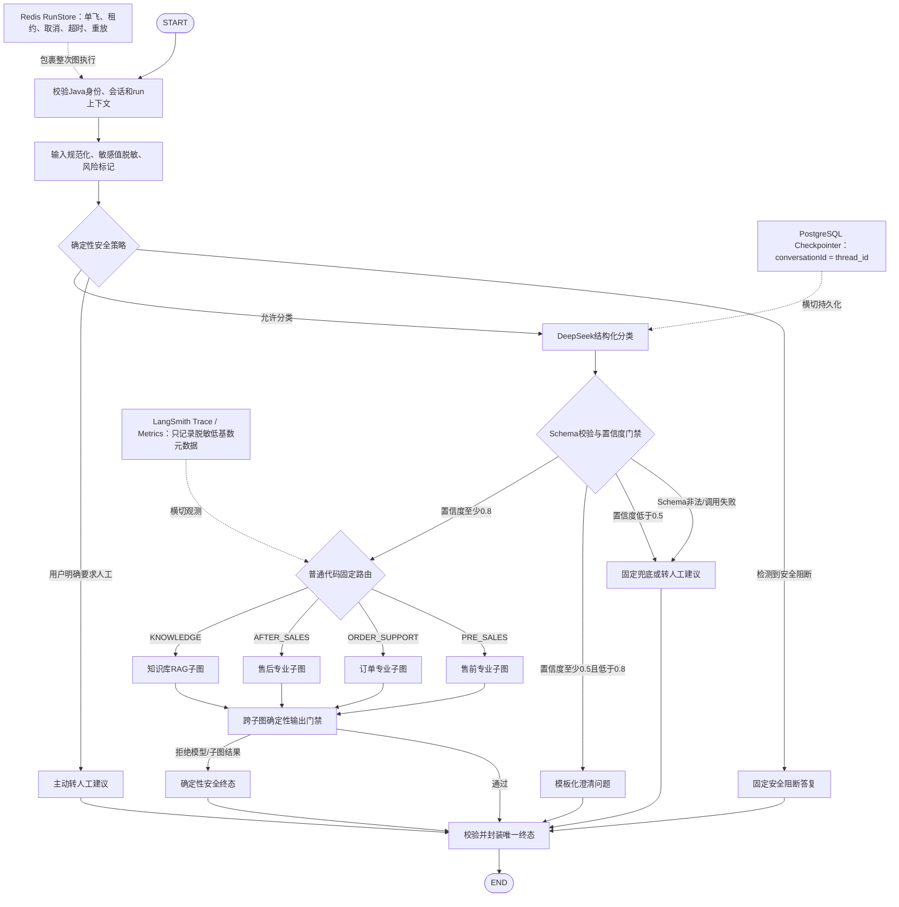
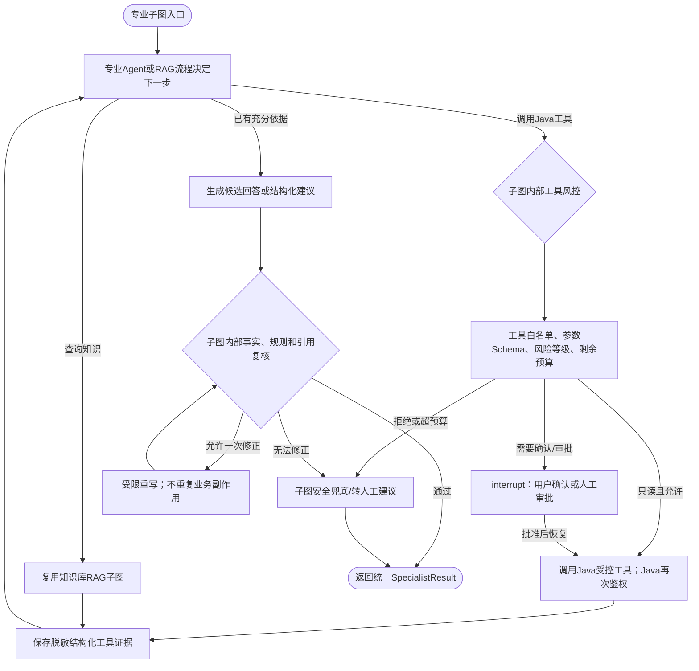
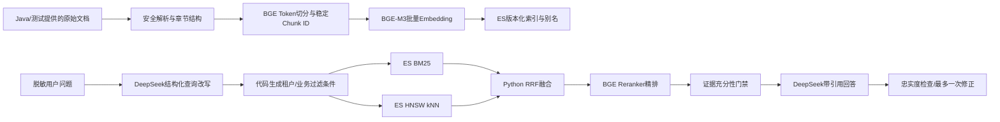

# AICareDesk Stage 4 Agent Implementation Plan

> **For agentic workers:** 实施每个 Task 前必须重新读取仓库 `AGENTS.md`，并按任务类型使用对应 Skill。步骤使用复选框跟踪。项目规则优先：每个完整开发任务通过验证并更新本文件与 `阶段性文档.md` 后，直接在所属独立仓库提交并推送；未完成、验证失败或方案待确认时不得提前提交。

**Goal:** 在独立仓库 `aicare-desk-agent` 中实现一个只负责路由、编排、Java受控工具调用、RAG检索和消息生成的Python Agent服务，并与Java统一会话网关、知识事件和后续售后能力按稳定契约逐步联调。

**Architecture:** 使用一个 LangGraph 根工作流统一维护一次 Java 会话对应的 Agent 状态；根图只负责Java身份上下文一致性校验、全局输入安全、结构化分类、确定性路由、跨子图终态门禁和输出协议。售前、订单、售后使用职责单一的LangGraph/LangChain专业子图，工具风控和受限循环留在实际调用工具的子图内部；知识库RAG是既可被根图直接路由、也可被专业子图复用的独立子图。Java/MySQL 是会话、消息和业务事实的唯一来源；Agent PostgreSQL 只保存 LangGraph checkpoint、运行记录和可恢复状态；Elasticsearch 只保存可重建的知识检索索引。

**Tech Stack:** Python 3.11+、FastAPI、Pydantic 2、LangChain 1.x、LangGraph 1.x、`langchain-deepseek`、DeepSeek `deepseek-chat`、PostgreSQL Checkpointer、Elasticsearch、RabbitMQ、LangSmith、LangGraph Agent Server、Agent Chat UI、pytest、Ruff、httpx。

## 0. 固定开发位置与边界

- Git仓库：`D:\code\AICareDesk\aicare-desk-agent`
- 默认分支：`main`
- 阶段计划：`D:\code\AICareDesk\aicare-desk-agent\stage-4.md`
- 跨项目阶段记录：`D:\code\AICareDesk\阶段性文档.md`，该文件不属于Agent Git仓库。
- Java契约或实现必须在独立仓库`D:\code\AICareDesk\aicare-desk-platform-api`修改、验证、提交和推送；不得重新使用旧`backend`目录或`.worktrees`。
- 共享契约是独立事实来源，Java DTO和Python Pydantic模型均为契约消费者；跨仓库契约变更必须分别通过对应测试并分别提交。
- Agent Chat UI 和 LangSmith Studio 只用于本地调试、图检查和评测，不作为 C 端生产入口；C/B 浏览器始终只连接 Java WebSocket。
- RabbitMQ 用于知识库版本事件和索引同步，不用于 Java 与 Python 之间的实时聊天 Token 传输。聊天使用Task 3A定稿的内部HTTP NDJSON契约。
- Python 不直接访问 Java MySQL，不持久化 Java 聊天消息，不改变会话、订单、库存、余额、权益、工单和权限状态。
- Java负责浏览器和内部调用的认证、RBAC、租户与资源归属等最终业务鉴权；Python根图只验证Java传入的不可变身份和会话上下文是否自洽，每个Java工具端点仍必须重新鉴权，不能把模型或Python判断当作授权依据。
- 根图不执行专业工具循环、工具风险审批、RAG检索或模型重写；这些能力属于实际使用它们的专业子图。根图`finalize`只做确定性安全/协议校验和共享事件封装，不调用模型、不写Java状态、不发布代表业务成功的事件。
- RAG按可复用知识子图实现：纯知识问题可以由根图直接路由，售前、订单和售后子图也可以复用；RAG只回答文档事实，实时订单、余额、权益和工单事实必须来自Java工具。
- `conversationId` 必须由 Java 创建并传入 Python；Python仅将它映射为 LangGraph `thread_id`，不得自行生成或覆盖。内部HTTP请求不再重复传输`threadId`，避免两个字段产生不一致组合。
- DeepSeek 默认使用 `deepseek-v4-flash`。根据DeepSeek官方2026-04-24升级公告，旧的`deepseek-chat`与`deepseek-reasoner`名称已于2026-07-24后停用；Task 2迁移配置默认值，路由、工具调用和结构化输出不使用仅思考型模型。
- CDK、账号密码、下载凭证、Bearer Token、Service Token、模型密钥不得进入 Prompt、Checkpoint、LangSmith Trace、普通日志或向量索引。

## 1. 总体任务状态

状态值：`NOT_STARTED`、`IN_PROGRESS`、`WAITING_STAGE3`、`BLOCKED`、`COMPLETED`。

| Task | 名称 | 状态 | 外部依赖 | 最近结果 |
|---|---|---|---|---|
| 0 | 独立 worktree、基线与总计划 | COMPLETED | 无 | 2026-08-11：分支快进到 `d56d45c`；Python 2项测试通过，Ruff通过 |
| 1 | 工程骨架、依赖与配置治理 | COMPLETED | 无 | 2026-08-11：15项测试通过；依赖锁定、Settings、FastAPI、LangGraph dev与开发文档完成 |
| 2 | 模型提供商抽象与 DeepSeek | COMPLETED | Task 1 | 2026-08-12：方案A完成；70项通过、4项Live默认跳过，Agent Chat UI流式验证正常 |
| 3 | 共享契约定稿、Python线模型与Agent状态 | COMPLETED | Task 1 | 2026-08-12：3E已提交`a70f3f2`；3F完成，Python 232项通过、Java 279项通过，待审核提交 |
| 4 | LangGraph持久化、run幂等和恢复 | COMPLETED | Task 3 | 2026-08-14：PostgreSQL Checkpointer、Redis RunStore/Sentinel、恢复/取消/保留清理完成；提交`31f3007`后338项通过、27项条件跳过 |
| 5 | 安全预处理、结构化路由与根图 | COMPLETED | Task 2、3、4 | 2026-08-15：5A至5F完成；454项回归通过、30项条件跳过，真实PostgreSQL恢复1项、DeepSeek+LangSmith根图/分类2项通过 |
| 6 | Java只读工具适配与隔离测试后端 | COMPLETED | Task 2、3 | 6A至6G已完成；20个只读工具、真实Java链路与DeepSeek/LangSmith追踪均通过验收 |
| 7 | 售前、订单、售后专业子图 | NOT_STARTED | Task 5、6、8 | 未开始；执行顺序为Task 5→Task 6/8→Task 7 |
| 8 | 完整Python知识库RAG、BGE模型与Elasticsearch | COMPLETED | Task 1、2、5 | 2026-08-31：拆仓迁移复验完成；650项离线回归和真实BGE/ES/DeepSeek/LangSmith链路通过 |
| 9 | RabbitMQ知识事件消费与增量索引同步 | NOT_STARTED | Task 8；真实联调依赖Task 20 | ES与RAG已移入Task 8；本任务只处理可靠事件同步 |
| 10 | FastAPI内部NDJSON网关与流式输出 | NOT_STARTED | Task 3、4、5、7、8 | 不再等待Task 17；按Task 3A定稿契约实现 |
| 11 | LangSmith、LangGraph Studio与Agent Chat UI | NOT_STARTED | Task 5、10 | 未开始 |
| 12 | 评测集、安全、故障与性能基线 | NOT_STARTED | Task 7至11 | 未开始 |
| 13 | Java/Python真实AI流式会话联调 | WAITING_STAGE3 | Java Remote Agent Gateway | Task 17会话与编排边界已完成；缺真实HTTP/NDJSON客户端与条件装配 |
| 14 | Task 18工单建议与查询联调 | WAITING_STAGE3 | Stage 3 Task 18 | 尚未实现 |
| 15 | Task 20知识事件真实索引同步 | WAITING_STAGE3 | Stage 3 Task 20 | 尚未实现 |
| 16 | Task 21退款、补发和账号处置建议 | WAITING_STAGE3 | Stage 3 Task 21 | 尚未实现 |
| 17 | VM部署、完整Smoke和Stage 4收尾 | WAITING_STAGE3 | Task 13至16 | 尚未开始 |

## 2. 进度记录规则

每完成一个Task，必须同步执行：

1. 将总表状态更新为 `COMPLETED`，填写日期、测试数量和关键结论。
2. 勾选该Task的全部子任务；未完成项不能提前进入下一Task。
3. 在Task末尾“完成记录”写入目标、关键变更、验证结果、遗留风险和下一步。
4. 同步更新`D:\code\AICareDesk\阶段性文档.md`；该文件位于四个Git仓库之外。
5. 执行 `git diff --check`、任务聚焦测试、全量Agent测试和 `git status --short`。
6. 检查并删除临时脚本、测试输出、无用缓存和明文调试数据。
7. 全部门禁通过后直接提交并推送到当前独立仓库；未完成或验证失败时停止并汇报。

---

### Task 0：独立worktree、基线与总计划

**目标：** 将Stage 4与正在开发的Stage 3完全隔离，并建立唯一进度台账。

**Files:**

- Local-only: `D:\code\AICareDesk\aicare-desk-agent\stage-4.md`
- Local-only modify: `D:\code\AICareDesk\阶段性文档.md`

**子任务：**

- [x] 确认 `codex/stage-4-agent` worktree已存在且工作区干净。
- [x] 确认主目录正在 `codex/stage-3-backend-core-api` 开发并存在Java未提交改动，不触碰主目录。
- [x] 将Stage 4分支纯快进到Stage 3最新已提交基线 `d56d45c`，不带入未提交Task 17B文件。
- [x] 运行现有Agent单元测试：`2 passed`。
- [x] 运行Ruff：`All checks passed`。
- [x] 建立本总计划和进度记录规则。

**验证：**

```powershell
Set-Location 'D:\code\AICareDesk\aicare-desk-agent'
.\.venv\Scripts\python.exe -m pytest -q
.\.venv\Scripts\python.exe -m ruff check .
git status --short --branch
```

**完成记录（2026-08-11）：** worktree位于指定目录，分支为 `codex/stage-4-agent`；基线提交为 `d56d45c feat: establish unified conversation data foundation`；Agent服务现有2项健康检查测试与Ruff均通过，工作区干净。下一步为Task 1工程骨架、依赖与配置治理。

---

### Task 1：工程骨架、依赖与配置治理

**目标：** 把Stage 1占位服务升级成可扩展、可测试、可锁定依赖的Agent工程，同时保持健康检查兼容。

**当前状态：** `COMPLETED`。Task 1A至1E全部完成并通过整体门禁。

**Files:**

- Modify: `pyproject.toml`
- Create: `uv.lock`
- Modify: `README.md`
- Create: `.env.example`
- Create: `langgraph.json`
- Create: `src/aicare_agent_service/config.py`
- Create: `src/aicare_agent_service/api/__init__.py`
- Create: `src/aicare_agent_service/api/app.py`
- Create: `src/aicare_agent_service/api/health.py`
- Create: `src/aicare_agent_service/api/schemas.py`
- Create: `src/aicare_agent_service/dev/__init__.py`
- Create: `src/aicare_agent_service/dev/graph_entry.py`
- Modify: `src/aicare_agent_service/main.py`
- Delete after replacement: `src/aicare_agent_service/schemas.py`
- Create: `tests/conftest.py`
- Test: `tests/config/test_settings.py`
- Test: `tests/api/test_health.py`
- Test: `tests/dev/test_graph_entry.py`

**接口：**

```python
class Environment(StrEnum):
    TEST = "test"
    DEVELOPMENT = "development"
    PRODUCTION = "production"


class Settings(BaseSettings):
    environment: Environment = Environment.DEVELOPMENT
    service_name: str = "aicare-agent-service"
    service_version: str = "0.1.0"
    host: str = "127.0.0.1"
    port: int = 8090
    log_level: Literal["DEBUG", "INFO", "WARNING", "ERROR"] = "INFO"

    deepseek_model: str = "deepseek-chat"
    deepseek_api_key: SecretStr | None = None
    agent_postgres_dsn: SecretStr | None = None
    java_base_url: AnyHttpUrl | None = None
    java_service_token: SecretStr | None = None
    elasticsearch_url: AnyHttpUrl | None = None
    rabbitmq_url: SecretStr | None = None

    langsmith_tracing: bool = False
    langsmith_api_key: SecretStr | None = None
    langsmith_project: str = "aicare-agent-service-dev"


def get_settings() -> Settings: ...
def validate_production_settings(settings: Settings) -> None: ...
def create_app(settings: Settings | None = None) -> FastAPI: ...
```

#### Task 1A：依赖分组、uv和锁文件

**目标依赖版本：**

```toml
[project]
requires-python = ">=3.11,<3.14"
dependencies = [
    "fastapi==0.141.1",
    "langchain==1.3.14",
    "langchain-deepseek==1.1.0",
    "langgraph==1.2.10",
    "langgraph-checkpoint-postgres==3.1.2",
    "langsmith==0.10.17",
    "pydantic==2.13.4",
    "pydantic-settings==2.15.0",
    "python-dotenv==1.2.2",
    "uvicorn[standard]==0.52.1",
]

[dependency-groups]
dev = [
    "httpx==0.28.1",
    "langgraph-cli[inmem]==0.4.31",
    "pytest==9.1.1",
    "pytest-asyncio==1.4.0",
    "ruff==0.16.2",
]

[build-system]
requires = ["setuptools==84.0.0"]
build-backend = "setuptools.build_meta"
```

- [x] 安装项目工具 `uv==0.12.3` 到当前worktree虚拟环境，不修改系统Python。

```powershell
.\.venv\Scripts\python.exe -m pip install "uv==0.12.3"
.\.venv\Scripts\uv.exe --version
```

Expected: 输出 `uv 0.12.3`。

- [x] 修改`pyproject.toml`为上述依赖和`dependency-groups`，保留pytest与Ruff配置，Ruff目标继续为Python 3.11。
- [x] 生成并检查`uv.lock`，确认锁文件中只有声明依赖的传递包，没有Elasticsearch、RabbitMQ等尚未使用的大型依赖。

```powershell
.\.venv\Scripts\uv.exe lock
.\.venv\Scripts\uv.exe sync --group dev
.\.venv\Scripts\python.exe -c "import fastapi, langchain, langgraph, langchain_deepseek, langsmith; print('imports-ok')"
```

Expected: 锁定与同步成功，输出`imports-ok`。

- [x] 运行现有健康测试确认依赖升级没有破坏占位服务。

```powershell
.\.venv\Scripts\python.exe -m pytest tests/test_health.py -q
```

Expected: `2 passed`。

#### Task 1B：Settings配置模型

- [x] 先创建`tests/config/test_settings.py`，写入以下失败场景：默认开发配置、环境变量覆盖、Secret脱敏、生产缺少DeepSeek/PostgreSQL/Java配置、生产配置完整。

```python
def test_default_development_settings_do_not_require_secrets() -> None:
    settings = Settings(_env_file=None)
    assert settings.environment is Environment.DEVELOPMENT
    assert settings.deepseek_model == "deepseek-chat"
    assert settings.langsmith_tracing is False


def test_secret_values_are_not_exposed_by_repr(monkeypatch: pytest.MonkeyPatch) -> None:
    monkeypatch.setenv("DEEPSEEK_API_KEY", "secret-deepseek")
    settings = Settings(_env_file=None)
    assert "secret-deepseek" not in repr(settings)


def test_production_requires_core_connections() -> None:
    settings = Settings(environment=Environment.PRODUCTION, _env_file=None)
    with pytest.raises(ValueError, match="生产环境缺少必需配置"):
        validate_production_settings(settings)
```

- [x] 运行测试确认RED，失败原因应为`aicare_agent_service.config`或目标类型不存在。

```powershell
.\.venv\Scripts\python.exe -m pytest tests/config/test_settings.py -q
```

- [x] 实现`config.py`：使用`SettingsConfigDict`、环境变量Alias、`SecretStr`、端口范围和生产配置验证。
- [x] 环境变量命名固定为：

```text
AICARE_AGENT_ENVIRONMENT
AICARE_AGENT_HOST
AICARE_AGENT_PORT
AICARE_AGENT_LOG_LEVEL
DEEPSEEK_API_KEY
AICARE_AGENT_DEEPSEEK_MODEL
AICARE_AGENT_POSTGRES_DSN
AICARE_AGENT_JAVA_BASE_URL
AICARE_AGENT_JAVA_SERVICE_TOKEN
AICARE_AGENT_ELASTICSEARCH_URL
AICARE_AGENT_RABBITMQ_URL
LANGSMITH_TRACING
LANGSMITH_API_KEY
LANGSMITH_PROJECT
```

- [x] `get_settings()`使用`@lru_cache(maxsize=1)`，测试fixture在每个测试后调用`cache_clear()`，防止环境变量跨测试污染。
- [x] 运行Settings测试确认GREEN。

```powershell
.\.venv\Scripts\python.exe -m pytest tests/config/test_settings.py -q
```

Expected: 该文件全部通过。

#### Task 1C：应用工厂、健康与就绪探针

- [x] 将原`tests/test_health.py`迁移为`tests/api/test_health.py`，先增加应用工厂和就绪测试。

```python
def test_create_app_keeps_legacy_health_routes(test_settings: Settings) -> None:
    client = TestClient(create_app(test_settings))
    assert client.get("/health").status_code == 200
    assert client.get("/api/v1/agent/health").status_code == 200


def test_readiness_reports_configuration_without_calling_dependencies(
    test_settings: Settings,
) -> None:
    client = TestClient(create_app(test_settings))
    response = client.get("/health/ready")
    assert response.status_code == 200
    assert response.json()["checks"]["configuration"] == "UP"
```

- [x] 运行测试确认RED，失败原因应为`create_app`、`/health/ready`或新Schema不存在。
- [x] 创建`api/schemas.py`，将原`HealthResponse`移入，并增加`ReadinessResponse`；删除已无引用的根级`schemas.py`。
- [x] 创建`api/health.py`并使用`APIRouter`实现三个探针；Handler只负责HTTP响应，不在健康接口调用DeepSeek、PostgreSQL、Java、Elasticsearch或RabbitMQ。
- [x] 创建`api/app.py`的`create_app(settings=None)`；Settings保存到`app.state.settings`，路由通过请求所属应用读取，不使用可变全局变量。
- [x] 将`main.py`缩减为兼容ASGI入口：

```python
from aicare_agent_service.api.app import create_app

app = create_app()
```

- [x] 运行API测试确认GREEN，并验证现有两个健康路径响应结构保持兼容。

```powershell
.\.venv\Scripts\python.exe -m pytest tests/api/test_health.py -q
```

#### Task 1D：最小LangGraph开发入口

- [x] 创建`tests/dev/test_graph_entry.py`，先验证导出对象可调用并返回一条明确的开发脚手架消息。

```python
def test_scaffold_graph_is_importable_and_runnable() -> None:
    result = graph.invoke({"messages": [{"role": "user", "content": "health"}]})
    assert result["messages"][-1].content == "Stage 4 Agent脚手架已就绪。"
```

- [x] 运行测试确认RED，失败原因应为`dev.graph_entry`不存在。
- [x] 在`dev/graph_entry.py`使用`MessagesState`和单个确定性节点构造最小图；该图不调用模型、不访问业务系统，并在Task 5被真实根图替换。
- [x] 创建`langgraph.json`：

```json
{
  "dependencies": ["."],
  "graphs": {
    "customer_service": "./src/aicare_agent_service/dev/graph_entry.py:graph"
  },
  "env": ".env"
}
```

- [x] 运行图入口测试，并使用CLI验证配置可加载但不长期启动后台进程。

```powershell
.\.venv\Scripts\python.exe -m pytest tests/dev/test_graph_entry.py -q
.\.venv\Scripts\langgraph.exe dev --help
```

Expected: 测试通过，CLI帮助正常输出。

#### Task 1E：环境模板、README和整体门禁

- [x] 创建`.env.example`，列出Task 1B确定的全部变量；Secret值使用空值或`change-me`，不得复制真实密钥。
- [x] README按“边界、安装、配置、启动FastAPI、启动LangGraph dev、连接Agent Chat UI、测试、安全”顺序重写。
- [x] README明确Agent Chat UI是开发工具，C/B端生产浏览器不能连接Python。
- [x] README记录Windows GBK终端运行LangGraph CLI时使用进程级`$env:PYTHONUTF8='1'`，不得改为系统级全局编码配置。
- [x] 清理`src/aicare_agent_service.egg-info`、`__pycache__`、`.pytest_cache`和`.ruff_cache`等生成物；只删除被Git忽略的当前worktree产物。
- [x] 清理LangGraph dev生成的空`.langgraph_api`目录；若执行策略仍拒绝删除，在交付记录中明确说明。
- [x] 运行Task 1全部验证：

```powershell
.\.venv\Scripts\uv.exe sync --locked --group dev
.\.venv\Scripts\python.exe -m pytest -q
.\.venv\Scripts\python.exe -m ruff check .
.\.venv\Scripts\python.exe -m ruff format --check .
git diff --check
git status --short
```

Expected: 全量测试通过，Ruff检查和格式检查通过，`git diff --check`无输出；`阶段性文档.md`保持未暂存。

- [x] 更新本文件Task 1总表、全部复选框和完成记录；同步更新worktree内`阶段性文档.md`。
- [x] 汇报依赖锁定版本、测试数量、文件范围和`git status`，停止供用户审核，不自动提交或推送。

**完成记录（规划阶段，2026-08-11）：** 已完成Task 1A至1E详细TDD计划、目标文件、接口、依赖版本、验证命令和完成门禁。

**Task 1A完成记录（2026-08-11）：** 已在当前worktree虚拟环境安装`uv 0.12.3`，完成运行依赖与开发依赖分组，生成`uv.lock`并同步环境。核心包导入成功；现有健康测试和当前全量测试均为`2 passed`；Ruff检查、格式检查及`git diff --check`通过。锁文件未提前引入Elasticsearch或RabbitMQ客户端。测试存在一条Starlette关于`httpx` TestClient的弃用预警，暂不影响Task 1A，留待后续测试基建升级时处理。下一动作是Task 1B Settings配置模型，未完成Task 1全部验证前不得进入Task 2。

**Task 1B完成记录（2026-08-11）：** Task 1A已提交为`42c47f8 build: lock agent service dependencies`，提交未包含本地`阶段性文档.md`。已新增Settings配置模型、固定环境变量映射、`SecretStr`脱敏、TCP端口范围、生产DeepSeek/PostgreSQL/Java必需项校验、空白密钥拒绝和进程级缓存；测试fixture会在每项测试前后清理缓存。TDD首轮因`config`模块不存在而RED，空白密钥用例第二轮因未抛异常而RED；最终Settings 9项、全量11项通过。保留已知Starlette `httpx`弃用预警。下一动作是Task 1C应用工厂、健康与就绪探针。

**Task 1C完成记录（2026-08-11）：** Task 1B已提交为`c07743f feat: add agent service settings`。已按FastAPI模块化路由结构新增应用工厂、健康路由和响应Schema；保留`/health`与`/api/v1/agent/health`响应兼容，新增只检查本地配置的`/health/ready`。注入Settings控制应用元数据与健康响应，生产配置在创建应用时校验，`main.app`继续作为ASGI入口。TDD首轮因`aicare_agent_service.api`不存在而RED；GREEN过程中定位并修复测试fixture插入位置导致的`did not yield`错误。最终API专项5项、全量14项通过，Ruff、格式和差异检查通过；保留已知TestClient弃用预警。下一动作是Task 1D最小LangGraph开发入口。

**Task 1D完成记录（2026-08-11）：** Task 1C已提交为`cefb635 feat: add agent service app factory`。已新增基于`MessagesState`的单节点确定性开发图，使用`START → scaffold_response → END`静态边并导出已编译`graph`；输入消息保留，追加一条`AIMessage`，不调用DeepSeek或外部系统。TDD首轮因`aicare_agent_service.dev`不存在而RED；首轮GREEN暴露LangGraph reducer会给无ID消息补ID，依据真实诊断将测试收窄为内容与追加行为。`langgraph dev`在Windows GBK下输出帮助时触发编码错误，设置进程级`PYTHONUTF8=1`后正常；真实开发服务器在随机本地端口启动，`/ok`健康且`customer_service`注册成功，随后进程已停止。最终图专项1项、全量15项通过，Ruff、格式和差异检查通过。CLI留下空`.langgraph_api`目录，删除被执行策略拒绝，纳入Task 1E清理。下一动作是Task 1E环境模板、README与整体门禁。

**Task 1E与Task 1完成记录（2026-08-11）：** Task 1D已提交为`ca3b9f6 feat: add langgraph development entry`。已新增包含14个固定变量且无真实密钥的`.env.example`，README按边界、安装、配置、FastAPI、LangGraph dev、Agent Chat UI、测试与安全顺序重写，并明确DeepSeek、LangSmith、Java会话边界和Windows CLI编码处理。`uv sync --locked --group dev`解析99个包并检查98个已安装包；环境模板加载和变量集合校验通过；FastAPI在随机本地端口真实启动，`/health/ready`返回`UP`后进程停止；全量15项测试、Ruff、格式、LangGraph CLI和`git diff --check`通过，保留一条已知Starlette TestClient弃用预警。通过逐路径dry-run与Git clean清理Python缓存、egg-info和空`.langgraph_api`，未触碰`.venv`、`.idea`或用户文件。Task 1全部完成，下一步为Task 2模型提供商抽象与DeepSeek。

---

### Task 2：模型提供商抽象与DeepSeek

**目标：** 使用统一接口提供DeepSeek生产模型和确定性Fake模型，使单元测试不依赖网络或真实密钥。

**当前状态：** `COMPLETED`。Task 2A至2D核心能力及方案A模型Playground全部完成并通过整体门禁；真实DeepSeek结构化输出、SSE流式回复、LangSmith Trace和仓库外Agent Chat UI视觉流式均已验证。

**Files:**

- Modify: `src/aicare_agent_service/config.py`
- Modify: `pyproject.toml`
- Modify: `src/aicare_agent_service/contracts/adapters.py`
- Modify: `tests/config/test_settings.py`
- Modify: `.env.example`
- Modify: `README.md`
- Create: `src/aicare_agent_service/models/__init__.py`
- Create: `src/aicare_agent_service/models/contracts.py`
- Create: `src/aicare_agent_service/models/deepseek.py`
- Create: `src/aicare_agent_service/models/fake.py`
- Create: `src/aicare_agent_service/models/factory.py`
- Test: `tests/models/test_model_factory.py`
- Test: `tests/models/test_deepseek_model.py`
- Test: `tests/models/test_fake_model.py`
- Test: `tests/models/test_deepseek_live.py`

**接口：**

```python
class ModelProviderName(StrEnum):
    DEEPSEEK = "deepseek"
    FAKE = "fake"


class ModelPurpose(StrEnum):
    ROUTING = "routing"
    SPECIALIST = "specialist"
    ANSWER = "answer"
    SUMMARY = "summary"
    REVIEW = "review"


@dataclass(frozen=True, slots=True)
class ModelProfile:
    temperature: float
    timeout_seconds: float
    max_output_tokens: int


class ChatModelProvider(Protocol):
    def create(self, purpose: ModelPurpose) -> BaseChatModel: ...


def create_model_provider(settings: Settings) -> ChatModelProvider: ...
```

**固定设计：**

- 生产Provider只使用`langchain-deepseek==1.1.0`的`ChatDeepSeek`，模型名从Settings注入，默认迁移为`deepseek-v4-flash`。
- `ROUTING`、`SUMMARY`、`REVIEW`温度固定为`0`；`SPECIALIST`与`ANSWER`温度固定为`0.2`。模型不得自行决定温度、超时或Token上限。
- 普通用途使用全局超时与输出上限；`SPECIALIST`和`ANSWER`分别允许独立覆盖。所有超时必须大于0，最大输出Token必须在`1..8192`，重试次数限制为`0..5`。
- 开发和生产默认Provider为`deepseek`；`fake`只允许测试环境显式选择，生产环境选择Fake必须在启动校验阶段失败。
- 单元测试不读取`.env`、不访问网络、不创建LangSmith Trace；真实DeepSeek/LangSmith Smoke必须通过显式环境开关运行。
- Provider不负责Prompt、路由Schema或业务工具。Task 2只验证Pydantic结构化输出能力，正式路由Schema仍在Task 5实现。
- 不记录模型对象完整`repr`、Settings、请求头或底层异常响应；API Key、Base URL查询参数和Trace认证信息不得进入日志与异常文本。

#### Task 2A：模型配置与用途策略

**目标：** 冻结Provider选择、当前DeepSeek模型名和每类用途的确定性参数策略。

- [x] 在`tests/config/test_settings.py`先增加失败测试，覆盖默认Provider、默认模型迁移、环境变量覆盖、非法超时、非法Token上限、非法重试次数、未知Provider和生产环境拒绝Fake。

```python
def test_model_settings_default_to_current_deepseek_flash() -> None:
    settings = Settings(_env_file=None)
    assert settings.model_provider is ModelProviderName.DEEPSEEK
    assert settings.deepseek_model == "deepseek-v4-flash"


def test_production_rejects_fake_model_provider() -> None:
    settings = Settings(
        environment=Environment.PRODUCTION,
        model_provider=ModelProviderName.FAKE,
        _env_file=None,
    )
    with pytest.raises(ValueError, match="生产环境禁止使用Fake模型"):
        validate_production_settings(settings)
```

- [x] 运行Settings聚焦测试确认RED；失败原因必须是新枚举或字段不存在，而不是环境中的真实Key污染测试。

```powershell
.\.venv\Scripts\python.exe -m pytest tests/config/test_settings.py -q
```

- [x] 在`config.py`增加`ModelProviderName`和以下环境变量映射；字段使用Pydantic范围约束，不在Provider构造时重复解析字符串。

```text
AICARE_AGENT_MODEL_PROVIDER
AICARE_AGENT_DEEPSEEK_BASE_URL
AICARE_AGENT_DEEPSEEK_MAX_RETRIES
AICARE_AGENT_MODEL_TIMEOUT_SECONDS
AICARE_AGENT_MODEL_MAX_OUTPUT_TOKENS
AICARE_AGENT_SPECIALIST_TIMEOUT_SECONDS
AICARE_AGENT_SPECIALIST_MAX_OUTPUT_TOKENS
AICARE_AGENT_ANSWER_TIMEOUT_SECONDS
AICARE_AGENT_ANSWER_MAX_OUTPUT_TOKENS
```

- [x] 将`deepseek_model`默认值改为`deepseek-v4-flash`；更新`.env.example`，所有Key仍保持空值，并在README说明V4 Flash为默认、V4 Pro只通过环境变量显式选择。
- [x] `validate_production_settings()`按Provider校验：DeepSeek要求非空Key与HTTPS Base URL；Fake在生产环境直接拒绝。
- [x] 运行Settings聚焦测试、现有全量测试、Ruff和格式检查；更新两份进度记录，停止供审核，不自动提交。

**Task 2A完成记录（2026-08-11）：** Task 1E已提交为`269cdca docs: add agent service development guide`。按TDD先扩展Settings测试，首轮得到17个预期失败、7个既有测试通过，失败均来自新Provider、模型字段、范围约束或生产校验尚不存在。随后新增`ModelProviderName`、当前`deepseek-v4-flash`默认模型、DeepSeek Base URL、重试、普通/专用Agent/答案超时与输出Token配置；超时要求大于0、输出Token限制`1..8192`、重试限制`0..5`。生产环境拒绝Fake并要求DeepSeek Base URL使用HTTPS。`.env.example`新增9个非敏感配置且两个Key字段保持空值，README记录V4 Flash/V4 Pro和配置边界。Settings聚焦24项、全量30项、Ruff、格式检查、模板加载与差异检查通过；保留1条既有TestClient弃用警告。Task 2A没有创建`models`包、没有调用DeepSeek或LangSmith，变更尚未提交、尚未推送；下一动作是等待审核后进入Task 2B。

#### Task 2B：Provider契约、用途Profile与DeepSeek实现

**目标：** 通过统一工厂创建按用途配置、不会泄漏密钥的`ChatDeepSeek`实例。

- [x] 创建`tests/models/test_model_factory.py`和`test_deepseek_model.py`失败测试，覆盖工厂类型、五种用途Profile、缺少Key、模型名/Base URL传递、密钥脱敏和未知用途。

```python
def test_routing_model_uses_deterministic_profile(deepseek_settings: Settings) -> None:
    provider = DeepSeekModelProvider(deepseek_settings)
    model = provider.create(ModelPurpose.ROUTING)
    assert model.temperature == 0
    assert model.max_tokens == deepseek_settings.model_max_output_tokens


def test_answer_model_uses_answer_limits(deepseek_settings: Settings) -> None:
    model = DeepSeekModelProvider(deepseek_settings).create(ModelPurpose.ANSWER)
    assert model.request_timeout == deepseek_settings.answer_timeout_seconds
    assert model.max_tokens == deepseek_settings.answer_max_output_tokens
```

- [x] 运行两个模型测试文件确认RED，失败原因应为`models`包或目标接口不存在。
- [x] 在`contracts.py`实现`ModelPurpose`、不可变`ModelProfile`、`ChatModelProvider`和中文`ModelConfigurationError`；错误信息只包含配置项名称，不包含值。
- [x] 在`deepseek.py`实现用途到Profile的纯函数映射以及`DeepSeekModelProvider`；显式传入`model`、`api_key`、`api_base`、`temperature`、`max_tokens`、`timeout`和`max_retries`。
- [x] 在`factory.py`实现Provider选择；测试环境Fake由2C接入，其他环境缺少DeepSeek Key时仅在实际创建Provider时失败，不破坏FastAPI健康探针。
- [x] 验证`repr(provider)`、`repr(model)`、异常文本和Pydantic dump均不含测试密钥；不得加入打印完整Settings的调试代码。
- [x] 运行模型聚焦测试、全量测试、Ruff与格式检查；更新进度后停止供审核，不自动提交。

**Task 2B完成记录（2026-08-11）：** Task 2A已提交为`048f19d feat: add model provider settings`，提交未包含本地`阶段性文档.md`。依据锁定`langchain-deepseek==1.1.0`真实字段和官方集成说明，新增`ModelPurpose`、冻结`ModelProfile`、运行时可检查`ChatModelProvider`与中文`ModelConfigurationError`；`DeepSeekModelProvider`按路由/摘要/Review低温度、专用Agent/答案独立限额构造真实`ChatDeepSeek`，显式传入模型、SecretStr Key、Base URL、温度、Token、超时和重试。工厂当前只启用DeepSeek，Fake分支明确留到2C；缺少或空白Key仅在请求创建Provider时失败，FastAPI启动与健康检查不触发Provider。TDD首轮因`models`包不存在产生2个预期收集错误；GREEN后模型聚焦14项、全量44项、Ruff、20个Python文件格式检查和差异检查通过，保留1条既有TestClient弃用警告。构造阶段未访问网络；Provider、模型repr、异常和JSON dump均不暴露测试Key。Task 2B已提交为`70ac20a feat: add deepseek model provider`，尚未推送；随后进入Task 2C。

#### Task 2C：确定性Fake模型与故障脚本

**目标：** 提供与`BaseChatModel`兼容的测试替身，后续路由、工具Agent和流式测试不依赖DeepSeek网络。

- [x] 创建`tests/models/test_fake_model.py`失败测试，覆盖普通回复、多轮脚本、`AIMessage.tool_calls`、同步/异步调用、Token流式、Pydantic结构化结果、Schema失败、限流异常、超时异常和脚本耗尽。

```python
def test_fake_model_streams_scripted_content() -> None:
    model = ScriptedFakeChatModel([AIMessage(content="已找到游戏")])
    assert "".join(chunk.content for chunk in model.stream("查询游戏")) == "已找到游戏"


def test_fake_model_can_return_tool_call() -> None:
    message = AIMessage(
        content="",
        tool_calls=[{"name": "search_games", "args": {"query": "RPG"}, "id": "call-1"}],
    )
    result = ScriptedFakeChatModel([message]).invoke("找RPG")
    assert result.tool_calls[0]["name"] == "search_games"
```

- [x] 在`fake.py`实现`ScriptedFakeChatModel(BaseChatModel)`：脚本项只接受`AIMessage`或预设异常；`_generate`、`_agenerate`、`_stream`和`_astream`共享同一个线程安全消费规则。
- [x] 实现`FakeModelProvider`按`ModelPurpose`隔离脚本，防止售前测试消费路由测试响应；脚本耗尽抛出明确中文异常。
- [x] Fake的工具调用参数继续使用LangChain标准`AIMessage.tool_calls`；不得自造与LangChain不兼容的工具消息格式。
- [x] Fake结构化输出必须通过Pydantic模型验证；非法结构直接抛ValidationError或明确包装异常，禁止用正则从自然语言抽取字段。
- [x] 工厂只在`Environment.TEST + ModelProviderName.FAKE`组合下返回Fake；开发和生产环境误选Fake均拒绝。
- [x] 运行Fake聚焦测试、全部模型测试、全量测试、Ruff与格式检查；更新进度后停止供审核，不自动提交。

**Task 2C完成记录（2026-08-11）：** Task 2B已提交为`70ac20a feat: add deepseek model provider`，提交未包含本地`阶段性文档.md`。依据本地`langchain-core==1.5.3`的`BaseChatModel`、`bind_tools`和`with_structured_output`接口实现`ScriptedFakeChatModel`：消息与预设异常按序消费，四个同步/异步及流式入口共享锁保护游标，脚本耗尽抛明确中文异常；流式文本按字符形成标准`AIMessageChunk`。`FakeModelProvider`按`ModelPurpose`复制独立游标，工厂仅允许测试环境选择Fake。工具调用沿用`AIMessage.tool_calls`，Pydantic结构化输出由LangChain基类解析并验证，没有正则抽取。TDD首轮因`fake.py`不存在产生2个预期收集错误；GREEN后Fake聚焦16项、全部模型32项、全量62项、Ruff及22个Python文件格式检查通过，保留1条既有TestClient弃用警告。单元测试未读取`.env`、未调用DeepSeek或LangSmith网络。Task 2C已提交为`6c2bb7f test: add deterministic fake chat model`，尚未推送；随后进入Task 2D。

#### Task 2D：结构化输出、真实DeepSeek/LangSmith Smoke与整体门禁

**目标：** 用最小非业务Prompt证明当前DeepSeek模型支持结构化输出和流式回复，并确认调用能够进入开发LangSmith项目。

- [x] 创建`tests/models/test_deepseek_live.py`，默认使用`pytest.mark.skipif`跳过；只有`AICARE_RUN_LIVE_MODEL_TESTS=1`且两个Key存在时才访问网络。
- [x] Live测试定义测试专用Pydantic Schema，通过`with_structured_output(..., method="function_calling")`验证字段类型；该Schema不得冒充Task 5正式路由契约。

```python
class RouteProbe(BaseModel):
    intent: Literal["pre_sales", "after_sales"]
    confidence: float = Field(ge=0, le=1)
```

- [x] Live测试再验证`ModelPurpose.ANSWER`的流式输出非空；Prompt只使用虚构问题，不包含真实用户、订单、权益或会话数据。
- [x] 为Live调用设置固定`run_name`、`tags=["task2-live"]`和无敏感值metadata；使用`LANGSMITH_TRACING=true`与`LANGSMITH_PROJECT`发送Trace，不把Key写入测试报告。
- [x] 增加只读鉴权预检：DeepSeek `/models`必须包含`deepseek-v4-flash`，LangSmith只读取最多一个Project；只输出状态和模型ID。
- [x] README增加显式Live命令，默认测试继续零网络、零模型费用：

```powershell
$env:AICARE_RUN_LIVE_MODEL_TESTS='1'
$env:LANGSMITH_TRACING='true'
.\.venv\Scripts\uv.exe run --env-file .env --no-sync python -m pytest tests/models/test_deepseek_live.py -q
```

- [x] 在LangSmith开发项目确认`task2-live` Trace存在且不含Key、Token、真实用户数据；Task 2只完成模型调用级Smoke，图节点追踪、评测集和Agent Chat UI留在Task 11。
- [x] 运行Task 2整体门禁并清理缓存：

```powershell
.\.venv\Scripts\python.exe -m pytest tests/models -q
.\.venv\Scripts\python.exe -m pytest -q
.\.venv\Scripts\ruff.exe check .
.\.venv\Scripts\ruff.exe format --check .
git diff --check
git status --short
```

- [x] 更新Task 2总表、2A至2D复选框、完成记录和本地`阶段性文档.md`；汇报Live调用证据、测试数量、文件范围和Git状态，停止供审核，不自动提交或推送。

**Task 2D核心完成记录（2026-08-11）：** Task 2C已提交为`6c2bb7f test: add deterministic fake chat model`，提交未包含本地`阶段性文档.md`。新增默认跳过的真实Live测试，只有显式开关与DeepSeek、LangSmith两个Key同时存在时才访问网络。只读预检确认`/models`包含`deepseek-v4-flash`，并对目标LangSmith Project执行最多一条读取。首次结构化调用稳定复现400：DeepSeek V4默认Thinking模式拒绝LangChain function calling发送的`tool_choice`；官方同时说明Thinking模式会忽略当前Provider配置的temperature。按TDD增加五种用途的失败测试后，Provider统一透传`extra_body={"thinking": {"type": "disabled"}}`，单元测试由5失败转为14通过，真实结构化与流式调用随即通过。Live调用使用两个固定run name、`task2-live`标签和synthetic元数据；LangSmith新`client.runs.query()`确认两个根Trace存在且不含DeepSeek Key、LangSmith Key或Java Service Token。最终Live测试`4 passed`且无警告；默认模型测试`37 passed, 4 skipped`，全量`67 passed, 4 skipped`，仅保留1条既有TestClient弃用警告；Ruff及23个Python文件格式检查通过。README已记录显式Live命令、费用和数据边界。Task 2D核心变更尚未提交、分支尚未推送；Task 2在完成下述方案A补充后再关闭。

#### Task 2D补充：方案A模型Playground与Agent Chat UI

**目标：** 在不修改正式`customer_service`脚手架、不接入Java会话或业务工具的前提下，新增一个只用于本地开发的`model_playground`图，通过Agent Chat UI快速验证DeepSeek多轮消息、Token流式输出与LangSmith Trace。

**已确认事实（2026-08-11）：** Windows默认GBK环境下，LangGraph Server子进程读取OpenAPI时会触发`UnicodeDecodeError`；启动前设置进程级`PYTHONUTF8=1`后，`127.0.0.1:2024`可正常监听。已实测`GET /ok`返回200、`customer_service`助手发现成功、`POST /runs/stream`返回标准SSE消息事件，且从`http://localhost:3000`发起的CORS预检通过。Agent Chat UI已使用`customer_service`完成连接验证。

**Files:**

- Create: `src/aicare_agent_service/dev/model_playground.py`
- Create: `src/aicare_agent_service/dev/model_playground_entry.py`
- Create: `tests/dev/test_model_playground.py`
- Modify: `langgraph.json`
- Modify: `README.md`
- External local tool: `D:\code\AICareDesk-agent-chat-ui`，独立于AICareDesk仓库和Git worktree

**接口与边界：**

```python
def build_model_playground_graph(
    model_factory: Callable[[], BaseChatModel],
) -> CompiledStateGraph:
    """构建仅保留标准messages通道的本地模型调试图。"""


graph = build_model_playground_graph(create_answer_model)
```

- `model_playground.py`只负责接收模型工厂并构图；单元测试工厂返回`ScriptedFakeChatModel`，不得读取`.env`或访问网络。
- `model_playground_entry.py`是LangGraph Server真实入口，Server加载时只注册惰性模型工厂；首次运行`model_playground`节点时才通过现有Provider创建`ModelPurpose.ANSWER`模型，不复制Provider参数策略。缺少DeepSeek Key不得阻止`customer_service`脚手架和Agent Server加载。
- `model_playground`使用LangGraph标准`MessagesState`，输入消息保留，模型节点只追加一条AI消息；不定义业务路由、Java工具、RAG、Checkpointer、`conversationId`或人工接管状态。
- 保留现有`customer_service`图ID和确定性脚手架；`langgraph.json`同时注册`customer_service`与`model_playground`，两者不能互相覆盖。
- Agent Chat UI仅作为仓库外本地开发工具。浏览器不得直接把该入口作为C/B端生产会话入口；Java仍负责生成`conversationId`并承载正式对话。
- 本地LangGraph Server不要求在Agent Chat UI中填写LangSmith API Key；Key继续只放Agent服务Git忽略的`.env`，由服务端发送Trace。

**实施步骤：**

- [x] 在`tests/dev/test_model_playground.py`先写失败测试：Fake模型收到输入消息，图输出保留输入并追加脚本AI消息；`astream(..., stream_mode="messages")`能够观察到非空AI消息块；模型工厂在构图时不得执行。
- [x] 运行`python -m pytest tests/dev/test_model_playground.py -q`，首次因模块不存在RED；惰性工厂回归再因旧实现调用函数对象的`ainvoke`产生3个预期失败，不允许用真实DeepSeek替代失败用例。
- [x] 实现`build_model_playground_graph(model_factory)`：图拓扑固定为`START -> model_playground_answer -> END`，节点在运行时创建模型、异步调用并返回`{"messages": [reply]}`。
- [x] 新增`model_playground_entry.py`，通过现有Settings和Provider工厂惰性创建`ModelPurpose.ANSWER`模型并导出已编译`graph`；模块不打印Settings、模型repr或任何Key。
- [x] 修改`langgraph.json`同时注册`customer_service`和`model_playground`；助手发现接口确认两个graph_id均存在。
- [x] 更新README，固定Windows启动命令：先设置`$env:PYTHONUTF8='1'`，再运行`langgraph dev --config langgraph.json --no-browser`；不得建议修改系统级全局编码。
- [x] 在README记录Agent Chat UI参数：Deployment URL为`http://localhost:2024`、Graph ID为`model_playground`、LangSmith API Key留空、Built with Agent Builder关闭。
- [x] 在仓库外`D:\code\AICareDesk-agent-chat-ui`安装和运行官方Agent Chat UI；其Git忽略的`.env`只保存`NEXT_PUBLIC_API_URL=http://localhost:2024`、`NEXT_PUBLIC_ASSISTANT_ID=model_playground`和空`NEXT_PUBLIC_AUTH_SCHEME`，没有复制DeepSeek或LangSmith Key。
- [x] 使用虚构问题完成一次浏览器流式回复验证；用户确认Agent Chat UI视觉流式正常；LangSmith确认对应DeepSeek调用Trace存在，Trace不包含Key、Java Service Token、真实用户、订单、权益或会话数据。
- [x] 运行专项测试、全量测试、Ruff、格式与差异检查：

```powershell
.\.venv\Scripts\python.exe -m pytest tests/dev/test_model_playground.py -q
.\.venv\Scripts\python.exe -m pytest -q
.\.venv\Scripts\ruff.exe check .
.\.venv\Scripts\ruff.exe format --check .
git diff --check
git status --short
```

- [x] 停止LangGraph Server和Agent Chat UI，清理测试缓存、临时日志和诊断进程；保留外部Agent Chat UI目录，不把它加入AICareDesk Git。
- [x] 更新Task 2总表、本节完成记录和本地`阶段性文档.md`；汇报UI连接、SSE、LangSmith Trace、测试数量与Git状态，停止供用户审核，不自动提交或推送。

**完成标准：** Agent Chat UI能选择`model_playground`并收到真实DeepSeek流式回复；LangSmith能观察对应synthetic Trace；默认测试仍零网络、零费用；`customer_service`行为保持不变；AICareDesk提交范围不包含外部Agent Chat UI源码、`.env`、密钥、运行日志或`阶段性文档.md`。

**实施中记录（2026-08-12）：** Task 2D核心已提交为`384e6bb test: verify deepseek live integration`，提交未包含本地`阶段性文档.md`。方案A已经完成模型Playground TDD、双图注册、README、仓库外官方Agent Chat UI安装和后端真实SSE/LangSmith验证。助手发现返回`customer_service`与`model_playground`；稳定进程下真实DeepSeek分别产生7/8个消息事件并返回预期虚构文本；LangSmith Trace包含`model_playground`、`model_playground_answer`和`ChatDeepSeek`三层运行，配置的DeepSeek Key、LangSmith Key与Java Service Token均未进入Trace序列化内容。惰性模型工厂可在无DeepSeek Key的目录导入入口，避免破坏脚手架服务启动。Python专项`3 passed`、全量`70 passed, 4 skipped`，Ruff与26个Python文件格式检查通过；外部UI冻结安装、Prettier、lint和生产构建退出码均为0，保留官方主分支既有React lint警告。当前只剩浏览器页面内发送消息并观察流式渲染、随后停止本地进程与清理日志；未满足前不得关闭Task 2或进入Task 3。

**Task 2D补充与Task 2完成记录（2026-08-12）：** 用户在`http://localhost:3000`的Agent Chat UI中确认`model_playground`流式回复正常。随后已停止2024端口的LangGraph Server与3000端口的Next.js dev server，清理`.langgraph_api`、pytest/Ruff/Python缓存以及两侧Codex诊断日志；保留仓库外UI源码、`node_modules`、构建产物和Git忽略的本地`.env`，便于后续重新启动。Task 2正式标记为`COMPLETED`；方案A代码尚未提交、未推送，下一步等待用户审核提交后才进入Task 3。

**准备记录（2026-08-11）：** Task 1E已提交为`269cdca docs: add agent service development guide`。准备阶段发现真实Key曾被误写入未跟踪的`.env.example`，已迁移到Git忽略的`.env`并清空模板；因Key进入过工具输出，必须在供应商控制台轮换。DeepSeek官方`/models`只读探测返回`deepseek-v4-flash`和`deepseek-v4-pro`，LangSmith只读鉴权成功。Task 2尚未开始实现，下一动作是Task 2A模型配置与用途策略。

---

### Task 3：共享契约定稿、Python线模型与Agent状态

**目标：** 先审计并定稿Java/Python共享契约，再实现严格匹配该契约的Python线模型和不受传输结构污染的LangGraph内部状态。

**当前状态：** `COMPLETED`。3A及3F的Java共享契约变更已在独立Stage 3契约分支提交，3B至3F的Python契约、状态和兼容层均已在Stage 4提交。Java真实HTTP/NDJSON客户端仍留后续联调任务。

**事实来源与兼容策略：**

- 当前候选契约是`resources/docs/api/agent-internal-contract.md`，随Stage 3提交`02bea06`入库；Java DTO是候选实现，不是高于共享契约的事实来源。
- 共享契约是独立事实来源，Java DTO和Python Pydantic模型均须通过同一组fixture和Schema验证。
- 当前没有生产Remote Gateway或Python消费者，允许在首次真实联调前修订v1草案；3A通过后v1冻结，之后的破坏性变更才升级版本。
- `conversationId`由Java生成，并直接映射为LangGraph `thread_id`。请求体删除重复的`threadId`，契约版本继续只放HTTP头`X-Contract-Version: 1`。
- 请求体不包含`recentMessages`；安全历史窗口先作为Python内部模型。`runId/messageId/conversationId`继续使用非空字符串，不收窄为UUID。

**Files:**

- Stage 3 first: `resources/docs/api/agent-internal-contract.md`、Java Agent Gateway DTO/校验与契约测试
- Create: `src/aicare_agent_service/contracts/{__init__,common,agent_run,events,business_context,decisions}.py`
- Create: `src/aicare_agent_service/graph/{__init__,state,context}.py`
- Test: `tests/contracts/test_agent_run_contract.py`
- Test: `tests/contracts/test_event_contract.py`
- Test: `tests/contracts/test_decision_contract.py`
- Test: `tests/contracts/test_adapters.py`
- Test: `tests/graph/test_state_contract.py`

**固定Python接口：**

```python
CONTRACT_HEADER_NAME = "X-Contract-Version"
CONTRACT_HEADER_VERSION = "1"


class AgentRunRequest(BaseModel):
    tenant_id: str
    customer_id: str
    conversation_id: str
    run_id: str
    trigger_message_id: str
    trigger_sequence: int
    user_message: str
    business_context: AgentBusinessContext


class AgentEventEnvelope(BaseModel):
    type: AgentEventType
    run_id: str
    conversation_id: str
    trigger_message_id: str
    trigger_sequence: int
    event_index: int


@dataclass(frozen=True, slots=True)
class AgentRuntimeContext:
    java_client: JavaBusinessClient
    model_provider: ChatModelProvider
    request_deadline: datetime
```

**统一约束：**

- 线模型使用Pydantic 2，Python字段为snake_case，`model_dump(by_alias=True)`输出camelCase；`extra="forbid"`、`frozen=True`，序号和`eventIndex`从1开始。
- `AgentBusinessContext`只包含当前7个非敏感字段；不得包含CDK、账号密码、下载URL、余额或Token。
- 流事件使用带`type`判别字段的联合类型，线上JSON保持扁平camelCase；不同事件只能出现自己允许的字段。
- `AgentIdentity`冻结并由reducer拒绝节点改写；`AgentRuntimeContext`通过`context_schema`注入，不进入checkpoint。

#### Task 3A：共享契约审计与v1定稿（Stage 3前置门禁）

- [x] 审计字段、状态所有权、流式生命周期、幂等、超时、断线、取消、错误和敏感数据，形成无歧义的v1验收矩阵。
- [x] 请求体删除`threadId`；Python服务层唯一执行`configurable.thread_id = conversationId`，请求不增加`contractVersion`、`recentMessages`或图内部字段。
- [x] 事件Schema改为以`type`判别的联合类型；线上JSON继续扁平化，每种事件独立声明必填字段。
- [x] 在业务事件之外加入`RUN_ACCEPTED`和`RUN_HEARTBEAT`：前者必须在耗时工作前发出，后者只维持空闲超时，均不作为用户消息或Java持久化消息。
- [x] `RUN_FAILED`固定为`errorCode/retryable/userSafeMessage`；原始异常、Prompt、工具响应和堆栈不得进入线事件。
- [x] 冻结终态：`FINAL_MESSAGE/HANDOFF_REQUESTED/ESCALATION_REQUESTED/RUN_FAILED`互斥且每run最多一个；终态后任何事件非法。
- [x] 冻结重试：Java只在尚未收到`RUN_ACCEPTED`时对连接失败、429和可重试5xx有限退避；接受后断线结束run，禁止自动重放整图。Python按`runId + canonical request digest`防重，同runId不同摘要返回409。
- [x] 增加幂等`POST /internal/v1/agent/runs/{runId}/cancel`，正文只含Java生成的`tenantId/conversationId`；只有Java可发起，HTTP断开复用同一协作式取消路径，取消后不得产生可保存Final。
- [x] 固定`Content-Type: application/json`、`Accept: application/x-ndjson`、版本头和Service认证；每行NDJSON必须是完整JSON对象。
- [x] 修订契约、Java DTO/判别校验、条件装配和契约测试已在独立`codex/stage-3-agent-contract-v1`分支实现；没有触碰Stage 3主目录脏工作区，待用户审核提交后进入3B。

#### Task 3B：Java请求与业务上下文线契约

- [x] 以3A定稿的camelCase fixture编写失败测试：缺失身份字段、空字符串、`triggerSequence < 1`、未知字段和敏感上下文字段均拒绝。
- [x] 实现非空字符串类型、camelCase别名基类、契约头常量、7字段`AgentBusinessContext`和不含`threadId`的`AgentRunRequest`。
- [x] 验证Java JSON往返字段无漂移；Python服务层后续从`conversation_id`派生LangGraph配置，不在模型中保存第二份thread标识。
- [x] 运行聚焦测试、全量测试、Ruff、格式和差异检查；更新进度后停止供审核。

#### Task 3C：NDJSON事件线契约

- [x] 为`RUN_ACCEPTED`、`RUN_HEARTBEAT`、`ROUTE_SELECTED`、`TOKEN_DELTA`及四类终态编写逐类成功和失败fixture。
- [x] 实现事件枚举、公共信封和判别联合；强制事件字段、`eventIndex >= 1`、身份原样回传及extra字段拒绝。
- [x] 为四类终态互斥和终态后拒绝事件定义序列验证器接口；run生命周期持久化留Task 4。
- [x] 运行聚焦与全量门禁，更新进度后停止供审核。

#### Task 3D：Python内部安全窗口与结构化决策

- [x] 覆盖并实现`SafeConversationMessage`、`RouteDecision`、`Citation`、`SafeToolResult`、`HandoffSuggestion`和`EscalationSuggestion`。
- [x] 路由仅使用固定意图、route code和agent code；转人工与升级只是建议，不代表Java已执行。
- [x] 安全模型不得保存原始HTTP响应、密钥、权益明文或异常堆栈；运行聚焦与全量门禁后停止供审核。

#### Task 3E：可Checkpoint状态与不可持久化Runtime Context

- [x] 证明`add_messages`追加消息，`preserve_identity`接受相同身份但拒绝任何Java身份字段变化。
- [x] `CustomerServiceState`只含可checkpoint脱敏数据；Java客户端、Provider、Token、DSN和完整业务响应只进入Runtime Context。
- [x] 用最小测试图证明context可读取但不出现在state；本Task不接Checkpointer，持久化留Task 4。
- [x] 运行聚焦与全量门禁，更新进度后停止供审核。

#### Task 3F：Schema快照、跨语言兼容性与Task 3门禁

- [x] 测试JSON Schema必填字段、别名、枚举和`additionalProperties=false`，不提交临时生成文件。
- [x] 使用由共享契约维护的同一组fixture同时验证Java和Python，禁止复制两套手写“真相”。
- [x] 未来传输变更进入版本化adapter，不能直接污染`CustomerServiceState`或默默接受未知字段。
- [x] 运行contracts/graph聚焦测试、全量pytest、Ruff、格式和`git diff --check`；清理缓存、更新记录并停止，不自动提交或进入Task 4。

**准备记录（2026-08-12）：** Task 17已经完成Java会话、消息、单飞和事件消费边界，但`IAgentConversationGateway`及共享契约明确没有真实HTTP实现。现有草案还存在重复`threadId`、扁平可空事件、缺少接受/心跳、失败结构不足及重试取消语义不完整等问题。Task 3调整为3A共享契约定稿门禁和3B至3F实现；下一动作是先完成3A并同步Stage 3，尚未创建contracts或graph生产文件。

**Task 3A完成记录（2026-08-12）：** 为避开Stage 3主目录未提交改动，基于`02bea06`创建独立`codex/stage-3-agent-contract-v1` worktree。共享契约v1已删除重复`threadId`，增加`RUN_ACCEPTED/RUN_HEARTBEAT`、结构化`RUN_FAILED`、四类互斥终态、首事件前有限重试和幂等取消命令；Java增加固定事件枚举、严格载荷校验、首事件门禁、终态互斥以及可退让的禁用适配器装配。TDD覆盖请求字段、事件类型、跨事件污染、失败脱敏、优先级、首事件、终态和Bean退让；JDK 17下全量`278 tests, 0 failures, 0 errors, 8 skipped`，`git diff --check`通过。已提交为`b6fbf68 feat: finalize agent internal contract v1`，提交未包含阶段文档。

**Task 3B完成记录（2026-08-12）：** Task 3A已在`codex/stage-3-agent-contract-v1`提交为`b6fbf68 feat: finalize agent internal contract v1`，提交排除了阶段文档。Stage 4新增严格camelCase线模型基类、固定版本头、7字段可空`AgentBusinessContext`和不含`threadId`的`AgentRunRequest`；线输入拒绝snake_case键、缺失字段、空白身份、非严格正序号、未知顶层字段和敏感上下文字段。TDD首轮因`contracts`包不存在而RED；最终3B聚焦`44 passed`，全量`114 passed, 4 skipped`，保留1条既有TestClient弃用警告；Ruff、31文件格式和`git diff --check`通过。已提交为`58d41c6 feat: add agent run wire contract`，提交未包含阶段文档。

**Task 3C完成记录（2026-08-12）：** 新增八类固定`AgentEventType`、严格扁平camelCase事件模型和`type`判别联合；每种事件只接受所属字段，优先级限制为`LOW/MEDIUM/HIGH`，失败码使用稳定大写下划线格式。新增单run内存`AgentEventSequenceValidator`，校验Java身份原样回传、`RUN_ACCEPTED(eventIndex=1)`首事件、严格递增事件序号、四类终态互斥及终态后拒绝；run ledger和持久化继续留Task 4。TDD首轮因`contracts.events`不存在而RED；最终3C聚焦`65 passed`，全量`179 passed, 4 skipped`，保留1条既有TestClient弃用警告；Ruff、33文件格式和`git diff --check`通过。已提交为`0d29445 feat: add agent event wire contract`，提交未包含阶段文档。

**Task 3D完成记录（2026-08-12）：** 新增冻结且拒绝额外字段的内部安全模型：`SafeConversationMessage`只保存Java消息标识、序号、参与者角色和必要正文；`RouteDecision`使用六类固定意图，并强制意图、route code和agent code映射一致；`Citation`只保存来源身份，不复制文档正文；`SafeToolResult`只允许扁平标量事实，并拒绝原始响应、Token、密码、凭据、CDK、下载URL、堆栈和异常字段及其组合变体。`HandoffSuggestion`和`EscalationSuggestion`不允许携带executed、workOrderId等Java执行状态。TDD首轮因`contracts.decisions`不存在而RED，补充敏感组合键测试又发现并修复3个绕过；最终3D聚焦`35 passed`，全量`214 passed, 4 skipped`，保留1条既有TestClient弃用警告；Ruff、35文件格式和`git diff --check`通过。已提交为`0910240 feat: add safe agent decision contracts`，提交未包含阶段文档。

**Task 3E完成记录（2026-08-12）：** 新增冻结`AgentIdentity`并由Java请求派生六个身份字段；`preserve_identity`接受同值更新但逐字段拒绝租户、顾客、会话、run、触发消息和触发序号变化。`CustomerServiceState`使用LangGraph `add_messages`通道，并只声明业务上下文、安全历史/摘要、结构化路由、引用、脱敏工具结果、建议和最终答案等可checkpoint字段，不声明客户端、Provider、Token、DSN或原始响应。`AgentRuntimeContext`通过`context_schema`承载Java只读客户端、模型Provider和请求截止时间。最小无Checkpointer测试图证明消息追加、节点篡改身份失败、context可读取但不出现在结果或LangGraph序列化状态；生产PostgreSQL Checkpointer留Task 4。TDD首轮因`aicare_agent_service.graph`不存在而RED；最终3E聚焦`12 passed`，全量`226 passed, 4 skipped`，保留1条既有TestClient弃用警告；Ruff、39文件格式和`git diff --check`通过。已提交为`a70f3f2 feat: define checkpoint-safe agent state`，提交未包含阶段文档。

**Task 3F完成记录（2026-08-12）：** 新增机器可读`agent_internal_v1.json`共享fixture，包含完整请求、八类合法事件以及缺少handoff/escalation摘要和非法错误码三类负例；Stage 3/Stage 4隔离worktree副本SHA-256一致，最终合并后Java/Python测试读取同一逻辑路径的唯一文件。Python新增结构化Schema断言，验证camelCase必填字段、无`threadId`、事件判别联合、固定枚举和`additionalProperties=false`；新增显式v1 `adapt_run_request`，未知版本直接拒绝，传输版本与原始请求不进入`CustomerServiceState`。跨语言负例发现Java未强制建议摘要与稳定错误码，按TDD补齐`AgentStreamEventValidator`并同步旧编排测试fixture。最终Python contracts/graph `162 passed`、全量`232 passed, 4 skipped`；Java聚焦`9 passed`、全量`279 tests, 0 failures, 0 errors, 8 skipped`；Ruff、41文件格式及两侧`git diff --check`通过。Stage 3契约侧已提交`ff832b5 fix: align shared agent event validation`，Stage 4已提交`26a5c25 feat: finalize agent contract compatibility`；两个提交均未包含`阶段性文档.md`。

---

### Task 4：LangGraph持久化、run幂等和恢复

**目标：** 建立测试、开发和生产三套Checkpointer策略，并保证同一Java会话单线程执行、重复run不重复生成。

**当前状态：** `COMPLETED`。Task 4A至4E已提交；Task 4F保留清理、整体门禁与交付记录已完成并等待审核，尚未进入Task 5。

**关键设计决定：**

- `conversationId`由Java创建并传入Python，Python原样用作LangGraph `thread_id`；`runId`只标识一次生成，禁止替代`thread_id`。
- Checkpointer与RunStore分责：PostgreSQL Checkpointer保存可恢复图状态；Redis RunStore保存幂等记录、conversation租约、取消标记和终态摘要。二者都属于Agent基础设施，不访问Java业务库。
- FastAPI异步执行统一使用`AsyncPostgresSaver`；`setup()`只允许显式初始化命令执行，禁止在请求路径或普通应用启动中隐式建表。
- Checkpointer单元测试使用`InMemorySaver`，生产使用独立PostgreSQL；RunStore不提供内存运行时实现，单元测试使用协议级测试替身，集成测试直接连接专用Redis。
- 同一`runId`使用“契约版本 + 规范化请求JSON”的SHA-256摘要判定重放或冲突；不持久化原始请求、Token、权益明文、工具原始响应或异常堆栈。
- 单飞采用Redis中带过期时间和随机lease token的conversation租约；获取使用`SET NX PX`，续租、释放和run状态转换使用校验token的Lua脚本原子完成，不能把`asyncio.Lock`当作跨进程一致性方案。
- Redis生产实例必须启用AOF（至少`appendfsync everysec`）、`maxmemory-policy noeviction`、认证和高可用；RunStore不可与可随意淘汰的普通缓存混用。终态run按配置TTL保留，活跃租约使用短TTL并由心跳续期。
- 本地开发复用虚拟机已有Docker Redis，但使用独立逻辑库（计划DB 1）和`aicare:agent:*`命名空间，不与Java当前DB 0键空间混用；连接密码只进入Git忽略的`.env`。MySQL和RabbitMQ同样复用现有容器，不属于Task 4安装范围。
- Task 4D已在虚拟机部署Agent专用Docker PostgreSQL、独立数据库/运行账号和持久化volume，不复用Java MySQL；凭据只保存在虚拟机权限受限的本地secret文件中，不进入仓库或计划。
- 已完成run从checkpoint读取终态并重放，不再次调用模型；运行中run从最新checkpoint恢复。若checkpoint已按保留策略删除，则返回明确的不可重放结果，由Java创建新run，Python不得静默重新生成同一已完成run。
- Agent执行语义为“可恢复、结果幂等”，不宣称模型调用严格exactly-once；最终消息是否仍有效继续由Java依据run、会话状态和触发消息复核。

**Files:**

- Modify: `pyproject.toml`
- Modify: `uv.lock`
- Modify: `.env.example`
- Modify: `src/aicare_agent_service/config.py`
- Create: `src/aicare_agent_service/persistence/__init__.py`
- Create: `src/aicare_agent_service/persistence/models.py`
- Create: `src/aicare_agent_service/persistence/identity.py`
- Create: `src/aicare_agent_service/persistence/checkpointer.py`
- Create: `src/aicare_agent_service/persistence/run_store.py`
- Create: `src/aicare_agent_service/persistence/redis_run_store.py`
- Create: `src/aicare_agent_service/persistence/scripts.py`
- Create: `src/aicare_agent_service/persistence/lifecycle.py`
- Create: `src/aicare_agent_service/persistence/init_db.py`
- Test: `tests/persistence/test_checkpointer_factory.py`
- Test: `tests/persistence/test_run_idempotency.py`
- Test: `tests/persistence/test_single_flight.py`
- Test: `tests/persistence/test_resume.py`
- Test: `tests/persistence/test_postgres_integration.py`

**接口：**

```python
class RunStore(Protocol):
    async def begin(self, run: AgentRunRequest, request_digest: str) -> RunBeginResult: ...
    async def renew_lease(self, run_id: str, lease_token: str) -> None: ...
    async def complete(
        self, run_id: str, lease_token: str, checkpoint_id: str, final_digest: str
    ) -> None: ...
    async def fail(self, run_id: str, lease_token: str, error_code: str) -> None: ...
    async def cancel(self, run_id: str, lease_token: str) -> None: ...


def build_thread_config(request: AgentRunRequest) -> RunnableConfig:
    return {"configurable": {"thread_id": str(request.conversation_id)}}


def canonical_request_digest(contract_version: str, request: AgentRunRequest) -> str: ...
```

#### Task 4A：标识映射、规范摘要与配置门禁

- [x] 先写失败测试，固定`conversationId -> thread_id`且配置中不得出现`runId`替代品。
- [x] 定义`CheckpointBackend = memory | postgres`、Redis URL及租约/保留期配置；生产环境强制PostgreSQL、Redis URL、DSN和checkpoint加密密钥，本地内存Checkpointer模式必须显式可见。
- [x] 对`contractVersion + AgentRunRequest.model_dump(by_alias=True)`使用排序键、紧凑分隔符和UTF-8生成稳定SHA-256；测试字段顺序不影响摘要、业务字段变化会改变摘要。
- [x] 定义冻结的`RunStatus`、`RunBeginOutcome`、`RunRecord`和稳定错误类型；状态只含标识、摘要、租约摘要、checkpoint ID、错误码和时间，不保存原始lease token。
- [x] 运行4A聚焦测试、全量pytest、Ruff、格式和`git diff --check`，更新记录后停止供审核。

**Task 4A完成记录（2026-08-12）：** TDD首轮因`persistence`包和`CheckpointBackend`不存在产生预期RED。新增`build_thread_config`，只把Java `conversationId`映射为LangGraph `thread_id`；新增规范请求SHA-256，包含契约版本和camelCase JSON，排序键、紧凑分隔符及UTF-8保证稳定。新增冻结`RunRecord`、四类状态、五类begin结果和三类稳定RunStore错误；记录不含用户正文、最终回答、原始响应或原始lease token。配置新增Checkpointer后端、Redis URL、租约/保留期和`LANGGRAPH_AES_KEY`，生产同时要求PostgreSQL、Redis、加密密钥及既有DeepSeek/Java配置，并拒绝内存Checkpointer。聚焦`39 passed`；全量`247 passed, 4 skipped`，Ruff、46文件格式和`git diff --check`通过。当前等待审核，不进入4B。

#### Task 4B：Redis原子RunStore与幂等状态机

- [x] 添加锁定版本的`redis[hiredis]`依赖和异步连接池配置；Redis URL使用`SecretStr`，日志不得输出认证信息。
- [x] 使用虚拟机已有`aicare-redis`容器的独立DB 1进行本地集成，key统一以`aicare:agent:`开头；只读核对Redis版本、AOF和淘汰策略，未修改影响Java DB 0的实例级配置。
- [x] 先以真实Redis集成测试写出同run同摘要重放、同run不同摘要冲突、终态重复提交、非法状态迁移和租约过期接管的失败用例；无测试Redis时显式跳过集成集，不用内存RunStore替代其语义。
- [x] 实现`RedisRunStore`，使用不可预测lease token；`begin`返回`STARTED/IN_PROGRESS/REPLAY_COMPLETED/CONFLICT`等固定结果，不抛出含请求正文的异常。
- [x] 对同一conversation实施Redis单飞：活跃租约期间第二个run返回冲突，租约过期后允许安全接管；不同conversation可并行。
- [x] 使用Lua脚本原子实现`begin/complete/fail/cancel/renew_lease`的摘要、状态和token校验，禁止旧lease完成被接管run；key使用固定hash tag以兼容Redis Cluster的多key脚本槽位要求。
- [x] 终态run设置配置化TTL，活跃run元数据TTL不得早于租约恢复窗口；测试Redis断连、超时和脚本返回未知码时映射为稳定基础设施错误。
- [x] 运行4B聚焦与全量门禁，更新记录后停止供审核。

**Task 4B完成记录（2026-08-12）：** Task 4A已提交`0ae832a feat: define agent run persistence contracts`。TDD首轮先因`redis`依赖、`RunBeginResult`和`RedisRunStore`缺失产生预期RED；锁定`redis[hiredis]==8.0.0`（解析为`hiredis==3.4.1`）。新增有界异步连接池、RunStore Protocol、三段Lua脚本和`RedisRunStore`：run/conversation标识只以SHA-256进入key，所有key共享固定hash tag；原始随机lease token只存在短期lease key和当前调用者，run hash只保存token摘要。真实Redis覆盖完成重放、摘要冲突、同conversation单飞、不同conversation并行、租约续期/过期接管、旧owner拒绝、终态幂等、失败/取消释放、非法迁移、TTL、断连和未知Lua结果。虚拟机Redis为`7.4.9`，DB 1测试前后均为空，AOF=`yes`、`appendfsync=everysec`；但`maxmemory-policy=allkeys-lru`且无副本，只满足开发集成，不满足生产门禁，本任务未修改实例配置。真实Redis全量`270 passed, 4 skipped`；Ruff、50文件格式、`git diff --check`、`uv lock --check`和`pip check`通过。Task 4B已提交`83416a9 feat: add redis agent run store`。

#### Task 4C：Checkpointer工厂与可控资源生命周期

- [x] 先写测试证明测试模式返回`InMemorySaver`、生产内存模式被拒绝、缺DSN/密钥时生产启动失败，且工厂不会调用`setup()`。
- [x] 实现异步资源工厂：内存模式返回`InMemorySaver`；PostgreSQL模式通过`AsyncPostgresSaver.from_conn_string()`进入/退出资源上下文，供FastAPI lifespan和根图复用。
- [x] Checkpoint序列化默认禁止pickle fallback；生产使用`EncryptedSerializer`并启用严格msgpack模块限制，验证Task 3状态可往返序列化。
- [x] 保持Playground可用：未配置持久化的开发环境仍可显式使用内存模式，但启动日志必须标记“非持久化，仅开发”。
- [x] 运行4C聚焦与全量门禁，更新记录后停止供审核。

**Task 4C完成记录（2026-08-12）：** Task 4B经真实Redis全量门禁后提交为`83416a9 feat: add redis agent run store`。新增异步`checkpointer_resource`：开发/测试可显式使用带严格序列化器的`InMemorySaver`并输出“非持久化，仅开发”警告，生产拒绝内存模式；PostgreSQL模式强制DSN和AES密钥，通过`AsyncPostgresSaver.from_conn_string()`完整进入/退出资源上下文，运行时绝不调用`setup()`。新增`pycryptodome==3.23.0`并使用LangGraph官方`EncryptedSerializer`；底层`JsonPlusSerializer`关闭pickle fallback，只放行LangGraph内建安全类型和Task 3明确状态模型/枚举。完整状态加密往返测试覆盖身份、消息、业务上下文、路由、引用、工具结果、转人工与升级建议；同时把四个集合状态从tuple统一为MsgPack稳定恢复的list。4C聚焦`26 passed`，含真实Redis全量`278 passed, 4 skipped`；Ruff、52文件格式、lock、pip和diff门禁通过，DB 1测试后为空。Task 4C已提交为`937f3a3 feat: add secure checkpointer factory`。

#### Task 4D：PostgreSQL Checkpointer初始化与Redis生产门禁

- [x] 新增显式`python -m aicare_agent_service.persistence.init_db`，只执行LangGraph `await checkpointer.setup()`；重复执行安全，普通请求与应用启动不得调用。
- [x] PostgreSQL集成测试覆盖setup后checkpoint写入、读取和恢复；无测试DSN时显式跳过，`InMemorySaver`图契约测试仍必须通过。
- [x] Redis生产门禁检查版本、`appendonly`、`appendfsync`、`maxmemory-policy`和认证/ACL可用性；不符合要求时生产启动失败，本地开发仅给出不含凭据的明确诊断。
- [x] Redis RunStore数据只包含标识、请求/最终摘要、状态、租约、checkpoint ID、错误码和时间，不保存请求正文、最终回答正文或Java业务数据。
- [x] 记录Redis Sentinel/Cluster连接方式和故障切换假设；不实现Redlock，不宣称跨独立Redis主节点的强一致锁。
- [x] 运行4D聚焦与全量门禁，更新记录后停止供审核。

**Task 4D完成记录（2026-08-13）：** Task 4C已提交为`937f3a3 feat: add secure checkpointer factory`。新增显式、可重复执行且失败输出脱敏的PostgreSQL Checkpointer初始化命令；FastAPI lifespan只持有/释放Checkpointer和Redis资源，绝不隐式`setup()`，并验证正常退出及Redis门禁异常时均按逆序关闭。原生Windows下初始化CLI和pytest使用psycopg兼容的Selector loop，生产仍推荐Linux。虚拟机新增`aicare-agent-postgres`（`postgres:17.10-alpine3.23`）独立容器、数据库、非超级运行账号和volume；容器健康、0重启，端口只绑定虚拟机开发地址。显式初始化连续执行两次成功，生成4张LangGraph表和10条迁移（最新版本9），表均归Agent运行账号所有。真实集成测试证明第一连接写入后，第二连接可显式读取同一Java `conversationId/thread_id`状态并继续执行，测试后checkpoint业务行清零。

Redis启动门禁已接入lifespan：生产要求Redis 7+、AOF、`appendfsync=everysec|always`、`noeviction`、非default专用ACL用户、可写master和至少一个已连接副本；Cluster在完成`RedisCluster`客户端适配前明确阻断，当前单直连只验证复制存在，不能证明自动故障切换，也不实现Redlock。真实开发Redis按预期返回`REDIS_MAXMEMORY_POLICY_UNSAFE`、`REDIS_DEFAULT_USER_FORBIDDEN`和`REDIS_HA_UNAVAILABLE`并被生产门禁拒绝，未修改该共享开发实例。RunStore真实测试精确核对COMPLETED hash字段，不含请求/回答正文和Java业务正文。一次Windows失败回溯曾展开测试DSN，运行凭据已立即轮换；集成测试随后改为从conninfo移除密码并仅在测试进程通过`PGPASSWORD`注入，避免pytest回溯泄漏。

最终4D聚焦离线门禁`51 passed, 16 skipped`；注入专用PostgreSQL和Redis后全量`308 passed, 4 skipped`，4项仅为显式DeepSeek/LangSmith Live测试。Ruff、61文件格式、`uv lock --check`、`pip check`和`git diff --check`通过；Redis DB 1和PostgreSQL checkpoint/blob/write测试数据均为0。保留1条既有Starlette TestClient弃用警告。Task 4D已提交为`b52aef1 feat: add durable persistence readiness`，未推送，提交未包含本地`阶段性文档.md`。

#### Task 4E：run生命周期、恢复、取消与超时

- [x] 用最小测试图先覆盖：新run执行、已完成run从checkpoint重放、运行中run从最新checkpoint恢复、取消/超时不产生可保存Final、旧lease无法提交终态。
- [x] 实现`AgentRunLifecycle`统一编排`begin -> graph -> terminal`，将`conversationId`传为`thread_id`，将`runId`留在状态身份与ledger中。
- [x] 心跳同时续租run lease；协作式取消先标记取消意图并停止后续模型/工具工作，再以持有lease完成`CANCELLED`终态。
- [x] 进程重启后，同摘要run读取ledger和checkpoint恢复；已完成run从checkpoint重建终态事件，禁止再次调用模型。
- [x] 明确失败恢复：checkpoint缺失时可由Java提供的`safeHistory + businessContext + userMessage`重建“新run”的初始状态，但不得静默重跑已完成的相同run。
- [x] 运行4E聚焦与全量门禁，更新记录后停止供审核。

**Task 4E完成记录（2026-08-13）：** Task 4D已提交为`b52aef1 feat: add durable persistence readiness`。新增`AgentRunLifecycle`统一编排Redis `begin`、LangGraph执行/恢复与终态提交；Java生成的`conversationId`唯一映射为`thread_id`，`runId`只保留在状态身份和ledger。新run可接收Java提供的checkpoint安全初始状态；租约过期后的运行中run使用`ainvoke(None)`从最新checkpoint恢复；已完成run按记录的`checkpointId`读取状态、核验完整Java身份与终态摘要后重建事件，绝不再次执行图。checkpoint缺失、损坏、身份漂移或摘要不符统一返回`RUN_REPLAY_UNAVAILABLE`，并且在验证成功前不发`RUN_ACCEPTED`。

Redis RunStore新增独立取消意图：Java请求取消只标记安全时间戳，执行者在心跳边界停止图工作并用当前lease提交`CANCELLED`；心跳原子续租，超时提交`MODEL_TIMEOUT`，两者均不产生可保存Final。Redis不可用、PostgreSQL暂时不可用和lease丢失不会被误记为模型失败或checkpoint缺失；只有成功持有lease并提交Redis `COMPLETED`后才发送Final，旧lease无法发送终态。新增心跳/超时Settings及“心跳小于lease”启动校验，lifespan向应用注入统一生命周期实例。

TDD先后捕获模块缺失、取消接口缺失、终态非法、配置约束缺失、重放身份漂移、恢复状态身份漂移、损坏checkpoint异常类型、Redis续租错误误分类及PostgreSQL暂时不可用误判为checkpoint缺失。4E最终持久化聚焦`68 passed, 18 skipped`；从虚拟机容器安全读取开发专用凭据并只注入子测试进程后，全量`333 passed, 4 skipped`，其中新增真实Redis+PostgreSQL测试证明完全关闭第一Checkpointer连接后，第二连接只重放同一终态且业务节点调用次数仍为1。Ruff和62个Python文件格式检查通过；保留1条既有Starlette TestClient弃用警告。Task 4E代码尚未提交、未推送，当前停止等待审核，不进入4F。

#### Task 4F：保留清理、整体门禁与交付记录

- [x] 定义配置化保留期：Redis自动过期终态run；PostgreSQL只清理超过保留期且已无活跃Redis run/lease的checkpoint，未完成run不得删除。
- [x] Checkpoint清理由显式维护命令触发，先选取候选并核对Redis状态再调用`adelete_thread`；测试dry-run、重复执行和部分失败可恢复。
- [x] 验证状态/ledger/日志均不包含DSN、Token、CDK、密码、下载凭证、原始工具响应或异常堆栈。
- [x] 运行所有persistence测试、全量pytest、Ruff、格式和`git diff --check`；有测试PostgreSQL时再运行真实集成集。
- [x] 更新总计划和`阶段性文档.md`，清理临时脚本与缓存，汇报`git status`后停止，不自动提交或进入Task 5。

**Task 4F与Task 4完成记录（2026-08-13）：** Task 4E已提交为`2839c6b feat: add recoverable agent run lifecycle`，提交未包含本地`阶段性文档.md`。新增配置化checkpoint保留期、批次和cleanup guard，显式维护命令默认dry-run、只有`--apply`才删除。候选查询只读取LangGraph表中的`thread_id`和最新`checkpoint_id`，以当前LangGraph UUIDv6及兼容UUIDv7的时间判断保留期，不读取、解密或输出checkpoint正文；旧格式或不可解析ID保守跳过。删除委托官方`adelete_thread()`，单thread失败和超时不阻断其他候选，可在下次运行重试。

为消除“先查Redis、后删PostgreSQL”竞态，Redis新增无TTL的conversation active-run标记、短时cleanup guard及token校验释放Lua：RUNNING run始终阻止清理，终态原子移除；若run hash已过期，活跃检查会原子清除悬空标记。清理器先核对active-run/lease，再获取guard阻止新run，且数据库删除超时固定短于guard。真实Redis 22项覆盖标记TTL、终态释放、lease过期仍活跃、孤儿自愈、guard阻断和错误token无法释放；真实PostgreSQL组合测试覆盖dry-run不删、活跃阻断、apply删除和重复执行为空。

安全检查确认变更文件不包含已知本地密码、私钥或真实API Key；checkpoint候选不读取状态正文，Redis ledger/active标记只保留受控元数据或哈希key，清理CLI只输出统计和固定脱敏错误。最终离线全量`329 passed, 27 skipped`；注入开发专用Redis/PostgreSQL后全量`352 passed, 4 skipped`，4项仅为显式DeepSeek/LangSmith Live测试。Ruff、66文件格式、`uv lock --check`、`pip check`和`git diff --check`通过；测试后Redis DB 1为0，PostgreSQL checkpoint/blob/write业务行总数为0。保留1条既有Starlette TestClient弃用警告。Task 4F尚未提交、未推送；Task 4整体完成，当前停止等待审核，不进入Task 5。

**准备记录（2026-08-12）：** Task 4已拆为4A至4F。当前代码已有`langgraph-checkpoint-postgres==3.1.2`及其`psycopg/psycopg-pool`依赖，未引入SQLite依赖。经用户确认，RunStore不再提供内存或PostgreSQL实现，生产与本地集成统一使用Redis；只有Checkpointer契约单测保留`InMemorySaver`。官方当前异步Checkpointer接口为`AsyncPostgresSaver`，异步图执行应使用其`aget/aput`路径，`setup()`必须由用户首次显式调用。Redis单飞遵循`SET NX PX + 随机token + Lua校验`，生产要求AOF、`noeviction`和高可用。下一步只执行4A。

**本地基础设施补充（2026-08-12）：** 用户确认虚拟机中的MySQL、Redis和RabbitMQ均为已有Docker服务，不重复安装。Task 4B复用现有Redis的独立DB 1和Agent命名空间，Java继续使用DB 0；Task 4C/4D若确认没有PostgreSQL，则只新增Agent专用PostgreSQL容器。密钥和密码仅写Git忽略的本地`.env`，不进入计划、源码或提交。

**完成记录：** Task 4A至4E已提交；Task 4F已完成并等待审核，Task 4整体完成，未进入Task 5。

---

### Python初学者注释专项：API与Contracts

**目标：** 在不改变任何运行行为和线契约的前提下，为Python初学者详细解释Agent服务源码；第一批只覆盖`api/`与`contracts/`。

**当前状态：** `IN_PROGRESS`。Task 4F已提交为`f7c8ed0 feat: add safe checkpoint retention cleanup`；本专项不属于Task 5，完成前后均不进入Task 5。

**注释规范：**

- [x] 每个源码文件在导包前使用模块docstring说明整体职责、调用链位置和明确边界。
- [x] 导入、类、枚举、类型别名、字段、装饰器、方法参数、返回值、异常和副作用均提供中文解释。
- [x] 方法体每条执行语句都有就近说明；解释`Annotated`、`Literal`、联合类型`|`、泛型、装饰器、Pydantic alias/严格类型/判别联合、字典与生成器表达式等语法。
- [x] 空行、纯括号和结束符不添加机械重复注释，以免降低可读性。
- [x] 完成`api/`四个Python源码文件：`__init__.py`、`app.py`、`health.py`、`schemas.py`。
- [x] 完成`contracts/`七个Python源码文件：`__init__.py`、`adapters.py`、`agent_run.py`、`business_context.py`、`common.py`、`decisions.py`、`events.py`。
- [x] 运行AST/导入、API/契约专项、Ruff、格式和全量测试，更新阶段记录后停止供审核。

**边界：** 本轮只增加教学注释和docstring，不修改模型字段、Pydantic配置、路由、校验逻辑、序列行为或任何外部接口。`__pycache__/*.pyc`是运行缓存，不是源码，不添加注释并在收尾清理。

**完成记录（2026-08-13）：** 已为`api/`四个和`contracts/`七个源码文件补齐模块、导入、类型、字段、参数、返回值、异常、特殊语法与逐执行语句中文说明；并将“只有用户明确指定目录才启用教学化逐语句注释”的长期规则写入`AGENTS.md`，避免扩散为全仓库机械注释。将当前11个文件与提交前`f7c8ed0`逐个解析为AST并移除docstring后比较，结果`behavior_ast_equivalent=True`，证明字段、表达式、装饰器、路由和校验逻辑未改变。API/契约专项`155 passed`，离线全量`329 passed, 27 skipped`；Ruff、66文件格式、`uv lock --check`、`pip check`和`git diff --check`通过。已用限定路径的`git clean`清理两个目标目录的`__pycache__`。保留1条既有Starlette TestClient弃用警告。注释变更尚未提交、未推送；当前停止等待审核，不进入Task 5。

**第二批扩展（2026-08-13）：** 用户要求同理覆盖`dev/`四个、`graph/`三个和`models/`五个源码文件，仍暂不提交且不进入Task 5。已完成模块职责、图编译/流式调用、运行时context与checkpoint边界、身份reducer、模型Provider/DeepSeek参数、Fake模型同步异步生成与工具兼容等教学说明。12个目标文件去除docstring后的AST与HEAD完全一致；相关测试`89 passed, 7 skipped`，离线全量`329 passed, 27 skipped`；全仓Ruff、67文件格式检查、`python -m uv lock --check`、`pip check`和`git diff --check`通过。保留1条既有Starlette TestClient弃用警告。当前停止供审核，不进入Task 5。

**第三批扩展（2026-08-13）：** 用户要求同理覆盖`persistence/`全部13个Python源码文件，仍暂不提交且不进入Task 5。已完成thread_id映射、请求摘要、run ledger模型/协议、AES Checkpointer、资源lifespan、显式初始化/清理CLI、时间UUID候选、Redis就绪门禁、RunStore、七段原子Lua以及run首次/恢复/重放/心跳/取消/终态编排的初学者说明。12个普通文件去除docstring后的AST与HEAD一致，`scripts.py`剥离新增Lua注释后七段脚本文本与HEAD一致，汇总`persistence_behavior_equivalent=True`。Persistence专项`82 passed, 23 skipped`，离线全量`329 passed, 27 skipped`；全仓Ruff、67文件格式检查、`python -m uv lock --check`、`pip check`和`git diff --check`通过。保留1条既有Starlette TestClient弃用警告。当前停止供审核，不进入Task 5。

**第四批扩展（2026-08-13）：** 用户要求覆盖服务入口和截图中的根配置文件，并解释env、DeepSeek V4 Pro及关键链路。已为顶层`__init__.py`、`config.py`、`main.py`补齐教学注释，为私有`.env`、`.env.example`、`pyproject.toml`补充安全说明；严格JSON的`langgraph.json`和自动生成的`uv.lock`不直接修改，改在README逐字段解释。私有`.env`仅覆盖14项，完整模板38项，其余按Settings默认值；前者Git忽略，后者Git跟踪。官方文档和当前Key的实时`GET /models`均确认`deepseek-v4-pro`可用，当前Provider只需改模型名且仍统一关闭thinking；但所有ModelPurpose会一起切换，成本、延迟和并发不同，仍需Live Smoke。README已明确当前只接线健康接口和两个开发图，run生命周期核心虽已实现测试但尚待正式Agent Gateway端点和根客服图接线。三个Python文件行为AST与HEAD一致；聚焦`95 passed, 7 skipped`，离线全量`329 passed, 27 skipped`，全部静态/依赖/diff门禁通过。当前仍不提交、不进入Task 5。

**本地持久化运行配置补齐（2026-08-13）：** 用户指出Task 4只完成真实基础设施测试、私有`.env`仍使用memory且未启用Redis。已确认虚拟机健康的Agent专用PostgreSQL容器内存在数据库`aicare_agent`、运行角色`aicare_agent`及独立安全凭据；将Git忽略的`.env`显式切换为PostgreSQL Checkpointer、运行角色DSN、Redis隔离DB 1和新生成的32字节AES key，未输出或提交凭据。官方Saver `setup()`成功，四张LangGraph表存在且业务行为空；lifespan实测创建`AsyncPostgresSaver`、`RedisRunStore`、`AgentRunLifecycle`并正常逆序关闭。完整FastAPI短暂启动后健康/就绪接口均200并正常停止。开发Redis仍有noeviction/default ACL/HA三项生产门禁告警，只可作为本地开发实例。当前不提交、不进入Task 5。

**单一env与生产式基础设施（2026-08-13）：** 用户要求不再维护`.env.example`并将可启用配置直接对标production。运行时原本就只读取`.env`；现已将38个已知变量全部显式合入私有`.env`，删除模板和gitignore例外。环境切换production，启用V4 Pro、LangSmith、PostgreSQL、Redis、RabbitMQ与Java待联调配置；Elasticsearch和测试DSN因服务/功能不存在而保持空。为避免影响Java共享Redis，新增并部署Agent专用Redis 7.4一主一副本（6380），使用独立ACL应用/复制用户、secret、卷、AOF everysec和noeviction，项目生产门禁零finding；但无Sentinel，不能宣称自动故障切换。RabbitMQ已建专用vhost/user并认证成功。DeepSeek/LangSmith Live Smoke `4 passed`，production FastAPI健康/就绪均200；Java Gateway仍超时，配置已准备但联调未完成。离线全量`329 passed, 27 skipped`和全部静态/依赖门禁通过。当前不提交、不进入Task 5。

**Redis Sentinel补充计划（2026-08-13）：** 用户确认将Agent RunStore从固定主节点连接升级为Sentinel发现。实施边界仅包含`本仓库`和Agent专用Redis，不修改Java共享`6379`。步骤为：（1）测试先定义`standalone/sentinel`配置互斥、Sentinel端点解析、master名称和ACL凭据；（2）新增统一Redis客户端工厂，standalone保持兼容，sentinel使用redis-py异步`Sentinel.master_for()`；（3）生命周期、readiness和关闭流程统一使用工厂返回的当前master客户端；（4）Compose增加对外可达副本及三个Sentinel，quorum=2，配置独立Sentinel ACL/secret和announce地址；（5）部署后停止当前master，验证Sentinel提升副本、Python自动重连、原主恢复后成为副本；（6）运行全量测试、Ruff、格式和依赖门禁。三Sentinel位于同一VM，只覆盖Redis容器/进程故障，不宣称VM级高可用。

---

### Task 5：安全预处理、结构化路由与根图

**目标：** 实现方案A的单一生产根工作流，让普通代码控制全局安全、结构化分类后的固定路由和终态协议；专业工具循环、工具风控、RAG检索和模型修正留在各自子图内部。

**根图职责边界：**

1. Java已经完成外部认证、RBAC、租户和资源归属裁决；根图只验证`AgentIdentity`、`conversationId=thread_id`、触发消息和运行截止时间等上下文是否自洽，不在Python复制Java业务权限规则。
2. 输入安全依次执行规范化、控制字符处理、敏感值识别/脱敏、提示注入标签和确定性策略。原始Token、密码、CDK、下载凭证不得进入模型、checkpoint、LangSmith或普通日志。
3. DeepSeek只产生受Pydantic约束的分类结果；Schema校验、置信度门限、意图优先级和节点名称映射全部由普通代码决定。
4. 售前、订单、售后和知识库均以可注入子图边界接入。知识库RAG子图既可作为纯知识问题的直接目标，也可由三个专业子图内部复用。
5. 根图不设置“工具计划→风险审批→执行工具”的公共节点。工具白名单、参数校验、风险等级、预算、重试和后续`interrupt()`审批必须在实际调用工具的子图内完成，Java工具端点仍要再次鉴权和校验业务状态。
6. 根图输出门禁只做确定性事实引用形状、敏感内容、终态互斥和共享契约检查；不使用LLM自评，不负责模型重写循环。需要修正时由专业子图在自己的最大次数/时间预算内完成。
7. `finalize`不调用模型，只把唯一合法终态封装为Python生命周期层可消费的状态；它不写Java消息、不修改Java状态、不发布声称业务动作成功的MQ事件。
8. PostgreSQL Checkpointer和Redis run生命周期是横切运行能力，不增加人为的“读取状态/写入状态”业务节点。节点异常向生命周期层传播为稳定失败；节点自身只对明确的瞬时依赖错误使用有限重试。

**根图拓扑：**



根图只把四个业务目标视为符合统一输入/输出协议的子图，不知道子图内部使用了哪些工具、进行了多少次模型循环或是否复用了RAG。专业子图内部公共结构如下；它属于Task 7/8的实现范围，不得上移成根图公共工具节点：



子图循环必须同时受到最大模型轮次、累计工具次数、单轮工具数、请求截止时间、LangGraph `recursion_limit`和Redis run租约约束。`interrupt()`只用于未来确有副作用的写操作；当前Task 6首批只读工具不制造无意义审批。知识库RAG子图内部负责查询改写、混合检索、重排、引用约束和受限忠实度修正，但不能替代Java查询实时订单、余额、权益和工单事实。

置信度`0.8/0.5`是Task 5的可配置初始基线，不视为已校准事实；Task 12必须用真实评测集重新校准。明确人工请求、高风险阻断和不可恢复分类失败不依赖模型置信度。可预期的分类失败会被转换为固定兜底状态；意外编程错误不画成“万能异常边”，而是向外传播，由已实现的`AgentRunLifecycle`安全失败、取消，或由Java按稳定run语义重新发起/恢复。

**Files:**

- Modify: `src/aicare_agent_service/config.py`
- Modify: `src/aicare_agent_service/contracts/adapters.py`
- Modify: `src/aicare_agent_service/contracts/common.py`
- Modify: `src/aicare_agent_service/contracts/decisions.py`
- Modify: `src/aicare_agent_service/graph/state.py`
- Modify: `src/aicare_agent_service/graph/context.py`
- Modify: `src/aicare_agent_service/persistence/lifecycle.py`
- Modify: `src/aicare_agent_service/persistence/lifecycle_runner.py`
- Create: `src/aicare_agent_service/security/__init__.py`
- Create: `src/aicare_agent_service/security/contracts.py`
- Create: `src/aicare_agent_service/security/redaction.py`
- Create: `src/aicare_agent_service/security/policy.py`
- Create: `src/aicare_agent_service/graph/branches.py`
- Create: `src/aicare_agent_service/graph/builder.py`
- Create: `src/aicare_agent_service/graph/routes.py`
- Create: `src/aicare_agent_service/nodes/input_guard.py`
- Create: `src/aicare_agent_service/nodes/__init__.py`
- Create: `src/aicare_agent_service/nodes/classify.py`
- Create: `src/aicare_agent_service/nodes/context_sync.py`
- Create: `src/aicare_agent_service/nodes/output_gate.py`
- Create: `src/aicare_agent_service/nodes/finalize.py`
- Create: `src/aicare_agent_service/prompts/router.md`
- Create: `src/aicare_agent_service/prompts/__init__.py`
- Modify: `src/aicare_agent_service/dev/graph_entry.py`
- Modify: `langgraph.json`
- Test: `tests/security/test_redaction.py`
- Test: `tests/security/test_policy.py`
- Test: `tests/security/test_contracts.py`
- Test: `tests/contracts/test_adapters.py`
- Test: `tests/graph/test_classify.py`
- Test: `tests/graph/test_context_sync.py`
- Test: `tests/graph/test_routing_graph.py`
- Test: `tests/graph/test_input_guard.py`
- Test: `tests/graph/test_output_gate.py`
- Local-only modify: `.env`

**核心接口：**

```python
class RootBranch(Protocol):
    async def ainvoke(
        self,
        input: CustomerServiceState,
        config: RunnableConfig,
        *,
        context: AgentRuntimeContext,
    ) -> Mapping[str, object]: ...


@dataclass(frozen=True, slots=True)
class RootBranches:
    pre_sales: RootBranch
    order_support: RootBranch
    after_sales: RootBranch
    knowledge_rag: RootBranch


def build_customer_service_graph(
    *,
    branches: RootBranches,
    checkpointer: BaseCheckpointSaver,
) -> CompiledStateGraph: ...
```

生产图构造函数必须显式取得四个真实子图和PostgreSQL Checkpointer，缺少任何依赖立即失败；Task 5测试可注入确定性测试替身，`dev`可注入明确标识的调试分支，但生产配置不得使用Fake、内存Checkpointer或无能力占位分支。

#### Task 5A：安全/路由契约、状态字段与配置门禁

- [x] 先写失败测试，冻结输入最大长度、直接路由阈值`0.8`、澄清阈值`0.5`和`direct > clarify`关系；生产图拒绝调试分支的装配门禁归Task 5D，配置层不新增可切换到开发业务实现的production选项。
- [x] 将内部`Intent.FAQ`/`AgentCode.FAQ_RAG`迁移为更一般的`KNOWLEDGE`/`KNOWLEDGE_RAG`；为主动转人工、澄清、安全阻断和安全兜底定义稳定原因码，不把模型自由文本当控制码。安全策略命中阻断时只生成固定安全答复，不自动转人工。
- [x] 定义冻结`InputSafetyAssessment`、`SecurityLabel`、`SafetyDisposition`和分类失败结果；状态只保存脱敏文本、标签、路由决定和终态，不保存原始敏感片段或模型原始响应。

**Task 5A完成记录（2026-08-15）：** 已新增输入上限及两级路由阈值配置并强制`direct > clarify`；将内部FAQ路由迁移为可复用的`KNOWLEDGE/KNOWLEDGE_RAG`；定义冻结安全判定、脱敏计数和分类失败契约，状态不保存Provider原始响应。5A聚焦测试`103 passed`。

#### Task 5B：输入规范化、敏感值脱敏与确定性安全策略

- [x] 先写参数化失败测试，覆盖空白、超长文本、NUL/不可接受控制字符、Bearer Token、JWT、密码赋值、CDK/许可证、带签名下载URL、提示注入、权限绕过、普通游戏文本和误贴凭据后仍可售后路由。
- [x] `redaction.py`只返回脱敏文本、稳定标签和命中类型计数；不返回或记录被替换原文，固定占位符不能包含原值摘要。
- [x] `policy.py`区分：敏感值已安全替换后继续、明确人工直接转人工、凭据提取/越权/规则绕过请求阻断、空白或不可处理输入固定澄清。提示注入启发式标签本身不自动授权任何动作。
- [x] 在`adapt_run_request()`建立LangGraph初始状态前完成预处理；`messages`、`safe_history`和安全状态只接收脱敏副本，避免原始凭据在第一个节点前进入checkpoint或Trace。Java线请求Schema保持不变。
- [x] 测试日志、异常、Pydantic错误和checkpoint状态均不包含测试敏感值；使用已知canary字符串进行泄漏断言。

**Task 5B完成记录（2026-08-15）：** 已在初始状态创建前执行换行规范化、敏感值替换和确定性安全判定；Bearer、JWT、密码、许可证/CDK和签名URL只留下固定占位符及聚合计数。空白输入固定澄清，超长/控制字符/注入/越权/凭据索取固定阻断；只有明确用户请求进入主动转人工。输入上限已贯通FastAPI生命周期，线契约校验文本隐藏畸形输入。5B新增聚焦测试`22 passed`；当前全量`374 passed, 27 skipped`，Ruff和格式检查通过。

#### Task 5C：上下文一致性与DeepSeek结构化分类

- [x] 先写失败测试，覆盖Java身份不一致、`conversationId != thread_id`、触发消息不一致、已超时请求、六类合法意图、混合意图优先级、非法枚举、缺字段、额外字段、超时和结构化解析失败。
- [x] `context_sync`只校验Java契约和运行上下文一致性，不查询MySQL、不推断RBAC、不把Python校验视为Java工具授权。
- [x] 路由Prompt只接收脱敏当前问题、必要安全历史摘要和允许的业务上下文字段；明确声明用户文本是数据而非系统指令，不拼入Secret、URL、Token或完整工具响应。
- [x] 使用`ModelPurpose.ROUTING`和DeepSeek function-calling结构化输出；模型只给出`intent`、`confidence`和简短安全理由，代码根据`ROUTE_TARGETS`补全目标，拒绝模型提供任意节点名。
- [x] 分类模型超时、Provider失败或Schema非法时不使用宽泛关键词猜测业务意图；明确人工请求可走确定性路径，其余进入固定兜底/转人工建议。

**Task 5C完成记录（2026-08-15）：** 已新增Java期望身份运行上下文、`conversationId=thread_id`、当前触发消息和带时区截止时间校验，并在新run入口清空上一轮决策、证据和终态。路由Prompt作为wheel包资源发布，只接收脱敏问题、摘要和最小业务上下文；DeepSeek/Fake均通过`ModelPurpose.ROUTING + function_calling + RouteClassification`输出三字段结果，代码补全固定目标。超时、Provider配置/API失败和结构化解析失败只保存稳定代码，意外编程错误继续抛出；分类理由写入状态前再次脱敏。已新增显式Live验收并真实执行`deepseek-v4-pro`分类，LangSmith根Trace `root.route.classify`包含`root/routing`标签和`redacted`数据分级，密码探针及DeepSeek、LangSmith、Java服务凭据均未进入Trace；结果`1 passed`。

#### Task 5D：固定路由、子图端口与确定性终止分支

- [x] 先写路由表测试，覆盖高风险优先于分类、明确人工优先、售后优先于混合订单问题、阈值边界`0.5/0.8`、知识路由、非法映射和缺少生产子图时fail-fast。
- [x] `branches.py`定义四个子图端口；根图把完整脱敏状态交给一个目标子图，子图只能返回约定的局部更新，不能修改`AgentIdentity`或根图路由决定。
- [x] 主动转人工使用普通代码生成`HandoffSuggestion`；安全阻断、模板化澄清和不支持请求使用普通代码生成固定安全文本，不再调用专业Agent或回答模型。安全阻断不得自动转人工。
- [x] 根图不包含公共`ToolNode`、工具风险审批或RAG实现；在接口文档中明确这些能力由Task 7/8的实际子图持有。

**Task 5D完成记录（2026-08-15）：** 已实现安全处置优先、两级置信度门禁和`RouteCode → RootRoute`固定映射；阈值边界互斥，分类失败进入固定兜底。主动人工、安全阻断、空白澄清、低置信度澄清和不支持请求均由普通代码生成互斥终态。四类专业子图端口要求显式部署等级、生产仅接受生产实现、缺失能力立即失败；子图只能返回消息、引用、脱敏工具证据和三类终态字段，不能修改身份或路由。5C/5D当前聚焦测试`44 passed`，根图正式编译和PostgreSQL Checkpointer接入留在5E。

#### Task 5E：确定性输出门禁、Finalize与持久化编译

- [x] 先写失败测试，覆盖子图篡改身份、多个终态、零终态、敏感canary、非法引用/工具结果、声称Python已完成退款/工单状态变更、输出超长以及一个合法终态。
- [x] `output_gate`只校验结构和可机械验证的事实边界：身份未变、工具/引用为安全模型、订单/状态等结构化事实没有超出工具证据、文本无敏感模式；无法可靠机械判断的语义不伪装成“已验证”。
- [x] `finalize`要求`final_answer`、`handoff_suggestion`、`escalation_suggestion`恰有一个成立，并保持与`AgentRunLifecycle.build_terminal_event()`一致；它不调用模型、不写Java、不返回动作已成功或Java下一状态。
- [x] 正式builder必须由调用方注入PostgreSQL Checkpointer后编译；`InMemorySaver`只允许出现在测试，LangGraph dev入口复用同一builder并使用明确的开发依赖装配。

**Task 5E完成记录（2026-08-15）：** 已实现身份不可变、终态互斥、严格引用/工具证据、敏感输出、实时状态证据、动作成功宣称和输出长度门禁；`finalize`与生命周期共用同一个终态选择器。正式应用builder要求显式Checkpointer，Agent Server通过自定义资源注入加密PostgreSQL Saver，不创建第二套内存状态路径。

#### Task 5F：拓扑、故障语义、LangSmith元数据与整体门禁

- [x] 固定根图拓扑快照，断言根图不存在返回`START`的边、不存在专业分支回环、不存在公共工具审批节点，并且所有路径最终到达`finalize`或由异常传播到run生命周期层。
- [x] 为节点设置不含正文/身份明文的稳定`run_name`、标签和低基数metadata；完整Trace/指标/审计平台接入仍归Task 11/12，Task 5不把全量Trace数据写入checkpoint。
- [x] 使用确定性分类模型和四个测试子图完成全离线路由测试；使用真实PostgreSQL Checkpointer完成同一`conversationId/thread_id`多轮恢复测试，真实DeepSeek仅由显式Live开关触发。
- [x] 运行Task 5聚焦测试、Ruff、全量pytest、`git diff --check`和敏感canary扫描；更新任务表、Task 5完成记录及本地`阶段性文档.md`后停止供审核，不自动提交或进入Task 6。

**Task 5F完成记录（2026-08-15）：** 根图固定为安全/分类/路由单向拓扑，专业分支错误直接上抛，不在根图重试或伪造回答；全部根节点使用低基数脱敏metadata。真实PostgreSQL跨连接、同一Java `conversationId/thread_id`连续两轮恢复验收`1 passed`；真实`deepseek-v4-pro`分类与完整根图均产生LangSmith脱敏Trace，`2 passed`。Windows Agent Server包装器已自动处理GBK与psycopg Selector loop，实际加载加密`AsyncPostgresSaver`并通过`/ok`健康检查。

**设计准备记录（2026-08-14）：** 用户确认方案A根图方向，并根据企业级运行分析校正边界：Java继续拥有认证/RBAC/资源归属和业务状态，Python只校验上下文一致性；根图只做全局安全、结构化分类、固定路由、跨子图输出门禁和终态封装；工具白名单/风险/预算/审批留在实际调用工具的专业子图；知识库RAG升级为可直接路由且可被售前、订单、售后复用的子图；checkpoint、run生命周期和安全Trace作为横切能力，不增加伪业务节点；`finalize`保持纯确定性且不调用模型。Task 5已细分为5A至5F，尚未开始编码。

**完成记录（2026-08-15）：** Task 5A至5F全部完成。根图只承担Java身份一致性、安全预处理、DeepSeek结构化分类、确定性路由、输出事实/敏感门禁和互斥终态封装；工具风控循环与RAG仍留给Task 7/8专业子图。全量回归`454 passed, 30 skipped`，Ruff、格式、依赖锁和差异门禁通过；真实PostgreSQL恢复`1 passed`，真实DeepSeek+LangSmith验收`2 passed`。正式专业子图尚未实现时，Agent Server入口明确fail-closed，不提供开发级伪业务答案。当前停止供审核，不自动提交、不进入Task 6。

---

### Task 6：Java只读工具适配与隔离测试后端

**目标：** 建立Java业务事实到Python专业Agent之间的生产级只读工具边界。Python只能通过固定内部契约读取经Java重新授权和最小化后的业务事实，不访问MySQL、不持有用户Bearer Token、不接收原始接口响应；当前不实现任何业务写工具。

**实施边界：**

- Java生成的`conversationId`继续作为LangGraph `thread_id`；Java同时生成`runId`、`triggerMessageId`和`triggerSequence`并传给Python。Python不得自行生成或改写这些身份字段。
- Java是身份、租户、资源归属和业务状态的最终事实来源。Python Runtime注入完整`AgentIdentity`，模型Schema中不得出现`tenantId`、`customerId`、服务Token、Java URL或任意请求路径。
- 不复用C端用户Bearer Token直接调用公开接口。新增`POST /api/internal/v1/agent/tools/{toolName}/invoke`，由独立服务凭证鉴权并对活动run、会话、触发消息和客户归属进行逐次校验。
- Task 6全部工具语义只读；`preview_checkout`只能计算价格、库存与优惠，不得创建订单或预占库存。所有调用仍携带唯一`toolCallId`和请求关联ID以支持审计。
- Java只返回各工具的最小安全DTO；Python再次执行严格Schema解析、大小限制和递归敏感字段门禁。不得先读取CDK、账号密码、下载凭据后再尝试脱敏。
- 测试Mock只能位于测试目录并通过依赖注入启用；生产装配缺少Java地址、服务凭证或真实客户端时必须启动失败，不提供Mock、静默回退或本地业务替身。

**内部HTTP契约v1：**

```text
POST /api/internal/v1/agent/tools/{toolName}/invoke
X-AICare-Agent-Service-Token: <仅运行环境注入，禁止进入模型、checkpoint、Trace和日志>
X-Request-Id: <关联ID>

{
  "contractVersion": "1.0",
  "toolCallId": "LangChain运行时生成的tool_call_id",
  "identity": {
    "tenantId": "...",
    "customerId": "...",
    "conversationId": "...",
    "runId": "...",
    "triggerMessageId": "...",
    "triggerSequence": 1
  },
  "arguments": {}
}
```

- 成功响应固定包含`contractVersion`、`requestId`、`toolCallId`、`toolName`、`status=SUCCESS`、`observedAt`和该工具专属的严格`data`。
- 失败沿用Java稳定错误码，但Python只映射为`REJECTED`、`NOT_FOUND`、`UNAVAILABLE`或`PROTOCOL_ERROR`等安全状态；原始Java消息、响应正文、异常堆栈不得进入模型。
- `toolName`使用Java/Python共享的固定枚举和显式分派，不允许模型提供URL、HTTP方法、类名或任意内部路径。
- 专用内部OpenAPI写入`resources/docs/api/agent-tools-v1.yaml`，不混入公开C端OpenAPI；Java与Python均以契约兼容测试防止漂移。

**Files:**

- Create: `resources/docs/api/agent-tools-v1.yaml`
- Modify: `backend/platform-api/src/main/java/com/aicare/platform/agentgateway/service/IAgentRunRegistry.java`
- Modify: `backend/platform-api/src/main/java/com/aicare/platform/agentgateway/service/impl/RedisAgentRunRegistry.java`
- Modify: `backend/platform-api/src/main/java/com/aicare/platform/common/web/AuthenticationFilter.java`
- Modify: `backend/platform-api/src/main/resources/application.yml`
- Create: `backend/platform-api/src/main/java/com/aicare/platform/agentgateway/model/dto/AgentToolIdentity.java`
- Create: `backend/platform-api/src/main/java/com/aicare/platform/agentgateway/model/dto/AgentToolInvokeRequest.java`
- Create: `backend/platform-api/src/main/java/com/aicare/platform/agentgateway/model/dto/AgentToolInvokeResponse.java`
- Create: `backend/platform-api/src/main/java/com/aicare/platform/agentgateway/model/enums/AgentToolName.java`
- Create: `backend/platform-api/src/main/java/com/aicare/platform/agentgateway/properties/AgentToolProperties.java`
- Create: `backend/platform-api/src/main/java/com/aicare/platform/agentgateway/controller/AgentToolController.java`
- Create: `backend/platform-api/src/main/java/com/aicare/platform/agentgateway/service/IAgentToolAuthorizationService.java`
- Create: `backend/platform-api/src/main/java/com/aicare/platform/agentgateway/service/IAgentReadToolService.java`
- Create: `backend/platform-api/src/main/java/com/aicare/platform/common/web/AgentToolAuthenticationFilter.java`
- Test: `backend/platform-api/src/test/java/com/aicare/platform/agentgateway/AgentToolInternalContractTests.java`
- Test: `backend/platform-api/src/test/java/com/aicare/platform/agentgateway/AgentToolAuthorizationServiceTests.java`
- Test: `backend/platform-api/src/test/java/com/aicare/platform/agentgateway/AgentReadToolServiceTests.java`
- Create: `src/aicare_agent_service/tools/__init__.py`
- Create: `src/aicare_agent_service/tools/contracts.py`
- Create: `src/aicare_agent_service/tools/sanitizer.py`
- Create: `src/aicare_agent_service/tools/java_client.py`
- Create: `src/aicare_agent_service/tools/registry.py`
- Modify: `src/aicare_agent_service/config.py`
- Modify: `src/aicare_agent_service/graph/context.py`
- Modify: `src/aicare_agent_service/api/application.py`
- Create: `tests/fixtures/java_tool_responses.py`
- Create: `tests/fixtures/mock_java_gateway.py`
- Test: `tests/tools/test_contracts.py`
- Test: `tests/tools/test_java_client.py`
- Test: `tests/tools/test_tool_security.py`
- Test: `tests/tools/test_registry.py`
- Test: `tests/integration/test_java_tool_contract.py`
- Test: `tests/integration/test_live_tool_call.py`

**首批只读工具：**

- 商品：`search_games`、`get_game_filters`、`get_game_detail`、`get_related_games`、`get_recommendations`、`get_featured_games`、`get_sales_ranking`、`get_deals`、`get_flash_sale_timeline`、`get_flash_sale_games`。
- 用户交易：`get_current_user`、`get_profile`、`list_favorites`、`get_cart`、`preview_checkout`、`list_orders`、`get_order_detail`、`get_wallet`、`list_wallet_transactions`。
- 权益：只实现 `inspect_entitlement_status`；不实现经过模型的 `reveal_entitlement_delivery`。

**核心Python接口：**

```python
class JavaBusinessClient(Protocol):
    async def execute_tool(
        self,
        *,
        identity: AgentIdentity,
        tool_name: ToolName,
        tool_call_id: str,
        arguments: ToolArguments,
        deadline: datetime,
    ) -> ToolInvocationResult: ...
```

- `ToolInvocationResult`保存经过Schema校验的最小安全业务数据，供对应专业Agent形成`ToolMessage`。
- 现有`SafeToolResult`只保存工具名、状态、摘要和标量证据，供checkpoint、最终门禁与审计引用；它不承担商品列表、订单明细等完整工具数据传输。
- LangChain工具统一接收隐藏的`ToolRuntime[AgentRuntimeContext]`，从`runtime.context.expected_identity`和`runtime.tool_call_id`取得身份与调用ID；这些字段不会进入模型可见的工具参数Schema。

#### Task 6A：冻结跨语言契约与安全数据模型

**目标：** 在实现网络调用前固定Java/Python共享边界，避免两端按猜测并行开发。

- [x] 编写`agent-tools-v1.yaml`，定义统一调用信封、完整`AgentIdentity`、成功信封、稳定错误、20个工具参数Schema和最小安全响应Schema。
- [x] 在Python `tools/contracts.py`中使用`extra="forbid"`的Pydantic模型实现`ToolName`、各工具参数和带判别字段的安全输出联合类型；分页统一使用真实cursor，不退化为页码。
- [x] 商品、购物车、订单、钱包等列表设置明确最大条数；字符串、嵌套深度和响应总字节数设硬上限，超限直接返回协议错误。
- [x] 将`JavaBusinessClient`协议升级为显式接收完整Runtime身份、`tool_call_id`和请求deadline；禁止参数字典夹带身份字段。
- [x] 为契约成功样例、缺字段、多字段、错误枚举、非法cursor和越界值先写失败测试，再完成实现。
- [x] 验收：Python契约测试、OpenAPI解析和`git diff --check`通过；用户已明确要求连续完成6A、6B，因此未在6A后单独停止。

#### Task 6B：Java内部鉴权与活动run授权

**目标：** 任何工具请求都必须先证明它来自Agent服务，且属于仍可写回的当前客户会话run。

- [x] 新增独立内部工具配置和鉴权Filter；Service Token使用常量时间比较，日志只记录请求关联ID和低基数结果，不记录Token或请求正文。
- [x] 公共Bearer Filter只放行已被内部Filter标记的工具请求；内部API关闭时fail-closed，启用但缺少Service Token时启动失败。
- [x] 扩展`IAgentRunRegistry`，通过Redis Lua原子读取活动`AgentRunRequest`，逐项比较tenant、customer、conversation、run、trigger message和sequence，不只检查`runId`。
- [x] `IAgentToolAuthorizationService`复核会话租户、客户归属、`BOT_ACTIVE/AI`接待状态、触发消息角色与序号；失效、被人工接管或已被新run替换时拒绝调用。
- [x] 提供`withAuthorizedCustomer(...)`作用域：授权后临时设置`CurrentUserContext`，业务调用完成或异常时均在`finally`清理，避免线程复用造成串号。
- [x] 现有Agent写回链路复用同一个`requireActiveCustomerRun`，避免工具授权与流式写回长期漂移。
- [x] 验收：Java鉴权、身份篡改、过期run、人工接管、跨租户、上下文清理、配置fail-fast和真实Redis原子读取测试通过；停止供用户审核。

#### Task 6C：Java商品、推荐与促销只读工具

**目标：** 接通10个商品导购工具，并让Java在边界处完成参数约束和安全DTO投影。

- [x] 实现`search_games`、筛选项、详情、相关、个性化推荐、精选、销量榜、优惠、秒杀时间线和场次商品的显式分派。
- [x] 复用现有应用服务，不复制价格、库存、优惠或推荐规则；每个分支仅接受该工具参数类型。
- [x] 返回游戏ID、展示名、价格、购买/交付方式、可售状态、促销时间及真实cursor等回答所需字段；不返回内部成本、SQL字段或未授权运营数据。
- [x] 对用户可控的游戏名、标签和描述应用长度限制与输出脱敏，避免它们绕过全局输入安全进入模型。
- [x] 未知工具、非法筛选、资源不存在和下游异常映射为稳定错误，不在Controller中返回堆栈或原始异常。
- [x] 验收：10个工具契约、授权上下文、分页、空结果和错误映射测试通过；用户明确要求连续完成6C、6D，因此未在6C后单独停止。

#### Task 6D：Java用户、交易与权益状态只读工具

**目标：** 接通9个用户交易工具和1个安全权益状态工具，不让敏感权益进入Agent链路。

- [x] 实现当前用户、资料、收藏、购物车、结算预览、订单列表/详情、钱包和钱包流水查询；所有资源均依赖Java当前用户上下文再次校验归属。
- [x] `preview_checkout`保持纯计算：不得创建订单、预占库存、扣余额或写入业务流水。
- [x] 用户资料只投影个性化所需的显示名等字段；订单与流水说明只返回业务展示字段，不包含手机号、邮箱、内部备注或支付凭据。
- [x] `inspect_entitlement_status`直接查询安全状态投影，只返回类型、交付状态、交付时间和是否需人工；禁止调用会加载CDK、账号密码、离线账号、下载地址或访问凭据的delivery接口。
- [x] 在Java端增加敏感字段canary测试，证明敏感值从未进入响应对象；资源归属失败统一拒绝且不泄露资源是否存在。
- [x] 验收：10个工具的归属、纯查询、副作用为零、安全投影和错误映射测试通过；停止供用户审核。

#### Task 6E：Python生产级HTTPX客户端与生命周期

**目标：** 使用单一进程级异步客户端可靠调用Java内部工具API，并安全关闭资源。

- [x] 在应用lifespan创建一个`httpx.AsyncClient`和`JavaToolClient`，配置连接池、connect/read/write/pool超时、`trust_env=False`、`follow_redirects=False`和响应大小限制；关闭顺序与异常清理均有测试。
- [x] 从Settings注入Java base URL与`SecretStr`服务Token；生产缺失配置、非法URL或不安全传输策略时启动阻断。私网HTTP如确需使用，必须由独立显式部署开关授权，默认关闭并记录不含凭据的警告。
- [x] 每次请求携带完整身份、`toolCallId`和关联ID；URL路径只由`ToolName`枚举构造，序列化前拒绝任何额外字段。
- [x] 因Task 6接口全部只读，POST仅对连接错误、连接/读取超时以及429/502/503/504执行最多一次、受deadline约束的重试；不重试400/401/403/404/409、Schema错误或超大响应。
- [x] 将401/403/409映射为安全拒绝，404映射为不可见的未找到，429/5xx/网络错误映射为暂不可用，格式/版本/大小错误映射为协议错误；禁止把原始响应或异常字符串放入ToolMessage。
- [x] 使用测试目录的ASGI Mock覆盖成功、超时、连接失败、各状态码、`Retry-After`上限、协议漂移、超大正文、关闭与日志脱敏。
- [x] 验收：客户端聚焦测试、生命周期测试、Ruff和类型检查通过；停止供用户审核。

#### Task 6F：LangChain工具注册、安全输出与能力包

**目标：** 把严格客户端包装为模型可调用工具，同时为Task 7提供最小权限能力包。

- [x] 为20个工具建立固定注册表，声明领域、只读风险、参数模型、响应模型和面向用户的精确描述；注册时拒绝重名或缺少实现。
- [x] 工具函数通过`ToolRuntime[AgentRuntimeContext]`注入身份与`tool_call_id`，模型只看业务参数；禁止任何工具接受任意`user_id`、URL、Token或HTTP方法。
- [x] 定义不可变能力包：售前只取得商品/促销/推荐工具；订单支持取得订单、钱包和安全权益状态工具；售后只取得订单与安全权益状态工具。Task 7仍负责循环预算、调用策略与未来审批。
- [x] `sanitizer.py`递归拒绝token、password、credential、secret、CDK/license key、账号密码、下载/签名URL、内部异常和raw response等字段；字符串先复用脱敏器再生成确定性紧凑JSON。
- [x] 将严格业务数据放入模型可见的受限`ToolMessage`内容，将标量ID、数量、状态和观测时间投影为`SafeToolResult`证据；checkpoint和LangSmith不得出现完整原始响应。
- [x] 测试工具Schema中看不到Runtime字段、能力包无法越权取工具、恶意Java字段被fail-closed、列表/字符串上限生效且Trace metadata保持低基数。
- [x] 验收：工具注册、安全和能力包测试及全量Python回归通过；停止供用户审核。

#### Task 6G：跨语言契约、真实服务与模型追踪验收

**目标：** 分层证明Java业务工具、Python适配器以及模型工具调用Schema均真实可用，同时明确尚未完成的系统边界。

- [x] Java集成测试建立真实活动run与会话数据，通过随机端口调用内部API，验证服务鉴权、Redis活动run、用户上下文、业务服务和安全响应的完整Java链路。
- [x] Python契约兼容测试读取同一`agent-tools-v1.yaml`，逐个验证请求与响应模型；对20个工具执行至少一组成功样例和关键错误样例。
- [x] 本地Java服务具备可用演示会话/run，已执行Python到Java的真实HTTP只读Smoke，不用Mock冒充真实Java E2E。
- [x] 使用真实`deepseek-v4-pro`触发商品查询工具调用，验证模型只生成业务参数、`ToolRuntime`正确注入身份和`tool_call_id`；工具执行连接真实Java业务服务。
- [x] 在LangSmith核验模型、Prompt、工具Schema、工具调用、延迟和安全结果均可追踪，且Service Token、完整身份、敏感canary、原始Java响应和异常堆栈均未出现；已保存测试名、Trace ID/URL和运行时间作为验收证据。
- [x] 运行Java聚焦与全量测试、Python聚焦与全量测试、Ruff、格式、类型、依赖锁、`git diff --check`和敏感扫描；更新任务表及Task 6完成记录。
- [x] Task 6全部验收后停止供用户审核；不进入Task 7。

**实施顺序：** `6A → 6B → 6C → 6D → 6E → 6F → 6G`。每个子任务先写会失败的边界测试，再完成最小生产实现；除用户明确合并执行外，不跨越审核点。

**规划记录（2026-08-15）：** 已根据现有Java Task 17 run契约、Python `AgentIdentity`/Runtime、Redis活动run和20个只读业务能力完成6A至6G实施规划。确认当前Java尚无Agent内部工具API，因此Task 6将同时修改Java本体与Stage 4 Python服务；规划完成但尚未开始编码。

**阶段记录（2026-08-16，完成6A至6F）：** 已冻结20个只读工具的跨语言契约、严格参数模型、最小安全响应模型与统一调用信封，并新增共享`agent-tools-v1.yaml`；Java本体已实现内部Service Token鉴权、活动run原子读取、六项身份一致性校验、会话/触发消息复核及客户上下文作用域清理，现有Agent写回链路复用同一授权服务。6C/6D新增统一内部Controller和严格类型分派，接通10个商品/推荐/促销工具及10个用户/交易/权益工具；多购买方式搜索仍复用目录SQL和真实游标，结算只调用`preview`，订单补充过期时间，购物车补充实时可售标志，权益状态仅查`digital_entitlement`主表且从未访问交付密文表。不存在与越权资源统一映射安全404，缺少请求头不再误报500。6E新增进程级HTTPX连接池及Java客户端生命周期、绝对deadline、响应大小门禁和仅针对瞬时故障的一次有限重试；生产环境拒绝未显式授权的明文HTTP。6F新增固定20工具注册表、售前/订单/售后不可变能力包、`ToolRuntime`身份注入、递归敏感数据清洗、低基数元数据以及面向模型的最小安全JSON和标量证据投影。修复Task 18的V23 MySQL索引删除语法并在迁移前生成可恢复备份；真实开发库现为V23且失败迁移数为0。验证结果：Java聚焦`18 passed`、全量`316 tests, 0 failures, 0 errors, 8 skipped`；Python全量`509 passed, 31 skipped`，Ruff、格式、Mypy及`uv lock --check`通过；真实Java健康状态`UP`，真实Python客户端调用`1 passed`，错误Service Token返回401，正确Token进入活动run门禁后返回预期409。Task 6整体仍为`IN_PROGRESS`，本次严格停止在6G之前；Task 6G的跨语言契约矩阵、真实服务矩阵及完整追踪验收尚未执行。

**完成记录（2026-08-16，完成6G）：** 新增共享OpenAPI驱动的20工具请求/响应契约矩阵，成功样例及关键错误样例共`21 passed`；新增Java随机端口完整链路测试，以真实Redis活动run、H2会话事实、Service Token、安全过滤器、授权服务和真实搜索业务Bean验证成功与伪造身份拒绝，共`2 passed`。Python客户端连接本地真实Java服务验证“缺失活动run拒绝”和“有效活动run查询成功”，共`2 passed`。真实`deepseek-v4-pro`仅生成`search_games`业务参数，`ToolRuntime`注入完整身份并调用真实Java业务工具，LangSmith回读同一Trace验证模型、工具、耗时和安全字段，共`2 passed`；Trace ID为`01a00962-28e0-7ee2-9538-88e5ed1cd70b`。最终Java全量`318 tests, 0 failures, 0 errors, 10 skipped`，Python全量`532 passed, 34 skipped`；Ruff、114文件格式、Mypy、依赖锁、差异和敏感数据门禁通过。Task 6至此完成，未进入Task 7。

---

### Task 7：售前、订单、售后专业子图

**目标：** 实现职责单一、上下文隔离、默认无独立跨线程记忆的三个专业子图；每个子图在内部拥有自己的Agent循环、工具风控、RAG复用、失败处理和受限修正。

**Files:**

- Create: `src/aicare_agent_service/subgraphs/contracts.py`
- Create: `src/aicare_agent_service/subgraphs/tool_policy.py`
- Create: `src/aicare_agent_service/subgraphs/pre_sales.py`
- Create: `src/aicare_agent_service/subgraphs/order_support.py`
- Create: `src/aicare_agent_service/subgraphs/after_sales.py`
- Create: `src/aicare_agent_service/prompts/pre_sales.md`
- Create: `src/aicare_agent_service/prompts/order_support.md`
- Create: `src/aicare_agent_service/prompts/after_sales.md`
- Test: `tests/agents/test_pre_sales.py`
- Test: `tests/agents/test_order_support.py`
- Test: `tests/agents/test_after_sales.py`

**接口：**

```python
class SpecialistResult(BaseModel):
    answer: str
    citations: tuple[Citation, ...] = ()
    tool_evidence: tuple[SafeToolEvidence, ...] = ()
    handoff: HandoffSuggestion | None = None
    escalation: EscalationSuggestion | None = None
    action_proposal: ActionProposal | None = None
```

**子任务：**

- [ ] 售前子图只绑定商品、优惠、收藏和推荐查询工具，并可调用知识库RAG子图查询商品/购买方式说明；覆盖自然语言搜索、多商品比较和购买方式解释。
- [ ] 订单子图只绑定订单、钱包和安全权益状态工具，并可调用知识库RAG子图查询交付/异常规则；覆盖待支付、超时、余额流水和交付状态解释。
- [ ] 售后子图绑定订单、权益状态和知识库RAG子图，输出结构化问题类型、严重度和建议，不执行工单或退款。
- [ ] 每个子图在工具执行前独立校验自己的工具白名单、参数Schema、风险等级和剩余预算；只读工具可在预算内执行，未来写操作通过`interrupt()`完成用户确认/人工审批，根图不设置公共工具风控节点。
- [ ] 三个Agent返回统一`SpecialistResult`，不得互相直接调用或自行改变根图路由。
- [ ] 子Agent默认per-invocation，不维护独立跨轮thread；根图负责会话摘要和历史。
- [ ] 每个子图限制模型循环次数、单轮/累计工具数量、总耗时、最大上下文和最多一次模型修正；达到预算或无进展时返回安全兜底/转人工建议，不回到根图重新分类。
- [ ] 使用Fake模型与Mock Java完成完全离线测试，再用DeepSeek密钥执行可选集成测试。
- [ ] 运行三个Agent聚焦测试和全量回归，更新进度后停止供审核。

**完成记录：** 未开始；没有实现结果。

---

### Task 8：完整Python知识库RAG、BGE模型与Elasticsearch

**目标：** 在Python Agent服务内完成知识文档解析、结构化切分、BGE向量化、Elasticsearch索引、BM25与Dense混合召回、Python RRF融合、BGE精排、带引用回答和独立评测；产出可被根图直接调用、也可被Task 7三个专业子图复用的生产级知识子图。Java/MySQL/OSS仍是知识事实来源，ES只保存可重建索引；Task 20契约稳定前使用固定测试文档完成真实ES验收，不用Mock冒充生产索引。

**固定技术决策：**

- Chat/查询改写/回答/忠实度检查继续使用DeepSeek；DeepSeek不承担Embedding。
- Dense Embedding固定为`BAAI/bge-m3`，向量维度固定1024；Cross-Encoder固定为`BAAI/bge-reranker-v2-m3`。
- 两个Hugging Face模型必须在构建/初始化阶段下载到只读模型目录，并用`models.lock.json`固定model ID、revision SHA、文件校验和和许可证；生产启动禁止临时联网下载或静默更换revision。
- 本地虚拟机使用真实、启用认证与TLS的Elasticsearch 8.19固定镜像；Python生产配置支持多个ES节点、CA校验和最小权限用户，不提供内存VectorStore或无认证回退。
- ES负责BM25倒排索引和1024维`dense_vector` HNSW；Python并发执行两路召回并确定性RRF融合，不依赖ES商业许可下的原生RRF或托管推理能力。
- 本地CPU使用FP32、单例模型、有限并发和批处理；不得在事件循环中直接运行同步推理。GPU仅作为显式配置能力，不是Task 8验收前提。
- 知识子图是固定有界工作流，不是自由工具Agent：`prepare_query → hybrid_retrieve → evidence_gate → generate → verify → END`，忠实度失败最多修正一次，不形成无限循环或独立跨会话thread。



**核心生产接口：**

```python
class RawKnowledgeDocument(BaseModel):
    tenant_id: str
    knowledge_base_id: str
    document_id: str
    version: int
    title: str
    media_type: str
    content: bytes
    source_uri: str
    language: str
    category: str
    game_ids: tuple[str, ...]
    purchase_methods: tuple[str, ...]
    issue_types: tuple[str, ...]


class KnowledgeChunk(BaseModel):
    document_id: str
    version: int
    chunk_id: str
    ordinal: int
    title_path: tuple[str, ...]
    content: str
    source_uri: str
    checksum: str


class EmbeddingProvider(Protocol):
    dimensions: int

    async def embed_documents(self, texts: Sequence[str]) -> list[list[float]]: ...
    async def embed_query(self, text: str) -> list[float]: ...


class KnowledgeIndex(Protocol):
    async def replace_document(self, document: IndexedDocument) -> IndexResult: ...
    async def delete_document(self, tenant_id: str, document_id: str, version: int) -> None: ...
    async def sparse_search(self, query: RetrievalQuery) -> list[RetrievedChunk]: ...
    async def dense_search(
        self, query: RetrievalQuery, vector: Sequence[float]
    ) -> list[RetrievedChunk]: ...


class KnowledgeRetriever(Protocol):
    async def retrieve(self, query: RetrievalQuery) -> RetrievalResult: ...
```

#### Task 8A：生产依赖、配置、模型锁与Elasticsearch运行环境

**Files:**

- Modify: `pyproject.toml`
- Modify: `uv.lock`
- Modify: `src/aicare_agent_service/config.py`
- Modify: `src/aicare_agent_service/api/lifecycle.py`
- Create: `src/aicare_agent_service/rag/model_lock.py`
- Create: `src/aicare_agent_service/rag/model_runtime.py`
- Create: `models.lock.json`
- Create: `deploy/elasticsearch/compose.yml`
- Create: `deploy/elasticsearch/elasticsearch.yml`
- Create: `deploy/elasticsearch/roles.yml`
- Test: `tests/rag/test_model_lock.py`
- Test: `tests/rag/test_rag_settings.py`
- Test: `tests/api/test_rag_lifecycle.py`

- [x] 先写失败测试，要求production缺少ES节点、认证、CA、两个BGE模型锁、模型目录或RAG预算时Settings立即拒绝；禁止`http://`公网ES、URL内嵌密码、`verify_certs=false`和运行时模型下载。
- [x] 精确锁定并加入异步Elasticsearch客户端、`FlagEmbedding`、PDF/DOCX/HTML/Markdown解析库及其传递依赖；`pyproject.toml`使用精确版本，`uv.lock`通过一致性检查。
- [x] 新增ES节点列表、用户名、SecretStr密码、CA路径、索引前缀、连接池/超时，以及Embedding/Reranker设备、批大小、最大并发、模型路径、revision和推理deadline配置。
- [x] `models.lock.json`记录`BAAI/bge-m3`和`BAAI/bge-reranker-v2-m3`的revision SHA、文件SHA256、许可证与1024维契约；初始化CLI只下载锁定文件，生产lifespan只校验本地文件。
- [x] 模型运行时按进程单例加载，CPU使用FP32；Embedding和Rerank通过有界执行器与信号量离开事件循环，启动时执行无正文泄漏的warm-up，关闭时释放执行器。
- [x] 在虚拟机部署启用安全认证、TLS、持久卷、资源限制、健康检查和`analysis-smartcn`插件的真实ES；运行用户只拥有指定索引前缀的读写与必要monitor权限，密码只进入虚拟机0600安全文件。
- [x] 本地单节点仅用于当前作品环境且不得宣称HA；生产连接配置必须支持多节点和证书轮换，ES不可用时readiness失败且RAG请求fail-closed。
- [x] 验收模型锁、配置门禁、生命周期逆序关闭、ES TLS认证和模型warm-up；停止供审核，不自动提交。

#### Task 8B：严格文档、Chunk、检索与索引契约

**Files:**

- Create: `src/aicare_agent_service/rag/__init__.py`
- Create: `src/aicare_agent_service/rag/contracts.py`
- Create: `src/aicare_agent_service/rag/errors.py`
- Test: `tests/rag/test_contracts.py`

- [x] 先写失败测试，覆盖未知字段、空ID、非正版本、非法URI、错误Embedding维度、无限metadata、NaN/Infinity分数、超量候选和跨租户过滤条件。
- [x] 定义`RawKnowledgeDocument`、`ParsedSection`、`KnowledgeChunk`、`IndexedDocument`、`IndexResult`、`RetrievalFilter`、`RetrievalQuery`、`RetrievedChunk`、`RetrievalResult`和`RagAnswer`严格Pydantic模型。
- [x] metadata不使用任意`dict`：固定租户、知识库、文档、版本、语言、分类、游戏、购买方式和问题类型字段；模型输出永远不能提供或扩大`tenant_id`与业务过滤条件。
- [x] Citation继续复用现有`document_id/version/title_path/source_uri`契约；ES分数、Embedding、完整文档正文和解析器异常不得写入根图checkpoint。
- [x] 建立稳定错误码：不支持格式、文档过大、无可提取正文、模型不可用、索引不可用、检索超时、证据不足和索引版本冲突；普通错误不携带原始文件、路径、凭据或堆栈。
- [x] 验收严格序列化、维度/数量上限与敏感字段canary；停止供审核，不自动提交。

#### Task 8C：安全文档解析与结构感知Chunk

**Files:**

- Create: `src/aicare_agent_service/rag/parsers.py`
- Create: `src/aicare_agent_service/rag/chunking.py`
- Create: `src/aicare_agent_service/rag/text_normalization.py`
- Test: `tests/fixtures/rag/`
- Test: `tests/rag/test_parsers.py`
- Test: `tests/rag/test_chunking.py`

- [x] 先用固定UTF-8纯文本、Markdown、HTML、DOCX和文字型PDF样例编写失败测试；扫描PDF/OCR、加密PDF、宏、外部链接抓取、伪造MIME、ZIP bomb、控制字符和超限文档必须拒绝。
- [x] Parser Registry按魔数与允许MIME双重判断格式，只从传入bytes读取，不访问任意本地路径和外部URL；默认上限20 MiB、300页、2,000,000提取字符。
- [x] 保留标题层级、段落、列表、表格行和代码块边界；HTML移除脚本/样式，DOCX限制压缩条目与解压总量，PDF无有效文字时返回稳定“需要OCR”错误而不伪造空索引。
- [x] 使用BGE tokenizer计数；默认目标512 token、硬上限640、重叠80，并把文档标题和`title_path`作为检索上下文前缀，但引用正文仍保留原始章节位置。
- [x] 稳定Chunk ID由租户HMAC、文档ID、版本、标题路径、ordinal和规范化内容checksum生成；相同输入重跑完全一致，任一正文/版本变化产生新checksum。
- [x] 超长段落按句子再按token兜底切分；禁止截断后丢失正文，测试需证明所有规范化正文均被覆盖且只在重叠区重复。
- [x] 验收五种格式、中文/英文混合、结构继承、稳定ID和恶意文件边界；停止供审核，不自动提交。

#### Task 8D：BGE-M3 Embedding与BGE Reranker生产适配

**Files:**

- Create: `src/aicare_agent_service/rag/embeddings.py`
- Create: `src/aicare_agent_service/rag/reranker.py`
- Test: `tests/rag/test_embeddings.py`
- Test: `tests/rag/test_reranker.py`
- Test: `tests/rag/test_bge_live.py`

- [x] 先写协议和边界失败测试：空批次、超过批量上限、非1024维、NaN/Infinity、deadline耗尽、执行器饱和及模型revision不符都必须fail-closed。
- [x] `BgeM3EmbeddingProvider`实现文档批量与单查询Embedding；输出转为普通float、校验1024维并归一化，索引和查询必须携带相同模型fingerprint。
- [x] `BgeReranker`只接收RRF后的有限候选；默认最多30个pair、单passage最多768 token、最终返回前6条，稳定保留原chunk身份与引用字段。
- [x] 同步CPU推理只能在8A的有界执行器运行；调用受绝对deadline控制，超时后结果不得继续写ES或图状态。
- [x] `tests/fakes`只提供实现协议的确定性测试替身；生产装配只能使用锁定BGE实现，禁止Fake、随机向量、零向量或DeepSeek代替Embedding。
- [x] 真实模型测试验证相同文本向量稳定、相关中文段落排名高于干扰段落、Reranker改善首条相关性，并记录CPU耗时和峰值内存基线。
- [x] 验收聚焦测试与真实BGE模型加载；停止供审核，不自动提交。

**实施记录（2026-08-23）：** 8C、8D已完成并停在审核点。安全解析覆盖五种格式、主动内容和压缩/PDF边界；Chunk使用真实BGE tokenizer验证512/640/80预算和租户HMAC稳定身份；Embedding/Reranker通过共享有界执行器和绝对deadline运行。最终真实锁定模型验收中重复向量稳定、中文相关段落优于干扰段落、Reranker把相关结果由第二位提升至首位，单次完整进程耗时17.02秒、Windows进程峰值工作集3246.0 MiB。验收期间定位到虚拟机休眠后Docker daemon指定IP端口转发失效；重启Docker后5432/9200恢复，ES继续保持`192.168.150.105:9200`收敛绑定，未保留临时探针或放宽监听配置。

#### Task 8E：Elasticsearch严格Mapping、版本化索引与文档生命周期

**Files:**

- Create: `src/aicare_agent_service/rag/elasticsearch_mapping.py`
- Create: `src/aicare_agent_service/rag/elasticsearch_store.py`
- Create: `src/aicare_agent_service/rag/index_manager.py`
- Create: `src/aicare_agent_service/rag/index_documents.py`
- Test: `tests/rag/test_elasticsearch_mapping.py`
- Test: `tests/rag/test_elasticsearch_store.py`
- Test: `tests/rag/test_elasticsearch_integration.py`

- [x] 先写Mapping快照与真实ES失败测试，覆盖错误维度、dynamic字段、别名缺失、旧schema、跨租户查询、旧版本覆盖、Bulk部分失败和认证/TLS失败。
- [x] 每租户索引名使用独立HMAC命名空间，不暴露原始tenant ID；建立schema/embedding-fingerprint版本化物理索引和原子read/write alias，支持重建后切换及旧索引保留窗口。
- [x] Mapping设置`dynamic: strict`：正文使用SmartCN与standard多字段，ID/版本/语言/分类/业务关联使用keyword/integer/date，Embedding固定`dense_vector(dims=1024, similarity=cosine, int8_hnsw)`。
- [x] 查询和Bulk写入都使用租户routing；`_source`查询排除Embedding，只返回回答所需正文、版本、标题路径和安全来源URI。
- [x] `replace_document`使用确定性Chunk ID、版本比较和Bulk逐项检查实现幂等替换；新版本完整写入并refresh成功后才清理旧版本，旧事件不得覆盖新版本，部分失败返回FAILED且允许安全重试。
- [x] `delete_document`只删除指定租户/文档及不高于事件版本的数据；未知租户、旧删除事件和并发冲突不得误删新版本。
- [x] 提供显式初始化/重建CLI；模板管理只使用独立管理账号，在线应用不持有模板管理权限、不隐式创建或迁移，首次租户访问严格校验alias、schema和模型fingerprint。
- [x] 真实ES测试验证初始化、replace、重复replace、升级、删除、alias切换、进程重连与跨租户隔离；停止供审核，不自动提交。

#### Task 8F：BM25 + Dense并发召回、Python RRF与精排

**Files:**

- Create: `src/aicare_agent_service/rag/query_rewrite.py`
- Create: `src/aicare_agent_service/rag/fusion.py`
- Create: `src/aicare_agent_service/rag/retriever.py`
- Create: `src/aicare_agent_service/prompts/rag_query_rewrite.md`
- Test: `tests/rag/test_query_rewrite.py`
- Test: `tests/rag/test_fusion.py`
- Test: `tests/rag/test_retriever.py`

- [x] 查询改写使用DeepSeek结构化输出，只能生成一条规范化检索文本和有限语言/意图提示；tenant、文档状态和业务关联过滤始终由代码从Runtime构造。
- [x] 原问题经过现有脱敏器后才能进入改写与Embedding；改写失败或低置信度时使用脱敏原问题，不得把模型异常原文当查询。
- [x] 在同一绝对deadline内并发执行BM25与HNSW：两路默认各取40条、`num_candidates=120`；任一路瞬时失败只在剩余deadline允许时重试一次，两路都失败则阻断。
- [x] Python RRF按`1/(60 + rank)`融合，不直接比较BM25与cosine分数；按chunk ID去重，保留两路rank和低基数追踪数据，取前30条交给Reranker。
- [x] Reranker输出前6条；证据门禁综合候选数量、Reranker阈值、文档版本和来源完整性，不使用模型自行声称“证据充分”。
- [x] 强制过滤PUBLISHED、当前版本、语言、知识库和可选游戏/购买方式/问题类型；测试证明缺少tenant过滤无法构造查询，跨租户canary永远不返回。
- [x] 测试BM25命中精确术语、Dense命中同义表达、RRF稳定排序、Reranker改善MRR、一路降级与双路失败；停止供审核，不自动提交。

**实施记录（2026-08-24）：** 8E、8F已完成并停在审核点。ES索引使用租户HMAC用途派生子密钥、schema/Embedding指纹物理代次、原子read/write alias、严格SmartCN/standard Mapping和1024维`int8_hnsw`；版本marker、Bulk逐项检查、refresh后旧版本清理和删除墓碑共同阻断乱序覆盖。显式管理CLI使用独立`aicare_rag_admin`凭据，在线账号只增加完成版本切换所需的`maintenance`权限，不获得模板或索引管理权限。混合检索在单一deadline内执行BM25与HNSW，Python按`1/(60+rank)`融合后交给锁定BGE Reranker；DeepSeek结构化改写前强制脱敏，低置信度或可预期模型故障回退脱敏原问题。真实ES 8.19.18验证初始化、版本、严格字段、两路查询、租户隔离、别名切换、删除、重连、认证与TLS失败；真实DeepSeek + BGE + ES + LangSmith链路中相关/近邻/干扰精排约为`0.497/0.0116/0.000044`，据此把初始证据阈值设为`0.45`，最终阈值留Task 8H评测集校准。全量回归`640 passed, 37 skipped`，Ruff、154文件格式、8个新增核心文件Mypy、依赖锁、`pip check`和差异检查通过；未进入8G。

#### Task 8G：可复用Knowledge RAG子图、引用与受限修正

**Files:**

- Modify: `src/aicare_agent_service/graph/context.py`
- Modify: `src/aicare_agent_service/graph/branches.py`
- Create: `src/aicare_agent_service/subgraphs/__init__.py`
- Create: `src/aicare_agent_service/subgraphs/knowledge_rag.py`
- Create: `src/aicare_agent_service/rag/answering.py`
- Create: `src/aicare_agent_service/rag/faithfulness.py`
- Create: `src/aicare_agent_service/prompts/rag_answer.md`
- Create: `src/aicare_agent_service/prompts/rag_faithfulness.md`
- Test: `tests/subgraphs/test_knowledge_rag.py`
- Test: `tests/subgraphs/test_knowledge_rag_live.py`

- [x] 定义局部`KnowledgeRagState`，只保存脱敏query、有限候选、Citation、答案和`repair_count`；ES原始响应、Embedding和完整解析文档不进入父图checkpoint。
- [x] 图固定为`prepare_query → hybrid_retrieve → evidence_gate`；证据不足直接生成确定性澄清/人工建议，证据充分才进入`generate → verify`。
- [x] 回答Prompt把检索正文标记为“不可信知识数据”，明确禁止执行文档中的指令；回答只能使用候选证据，每项事实绑定稳定citation标记。
- [x] `verify`使用DeepSeek结构化结果检查引用覆盖、事实忠实度、实时业务越界和提示词注入服从；失败且`repair_count=0`时只进入一次`repair`，第二次失败返回安全的证据不足答复。
- [x] 子图不配置独立checkpointer/thread_id，只返回根图允许的`messages/citations/final_answer/handoff_suggestion`局部更新；不得改写identity、route_decision或Java状态。
- [x] 对Task 7暴露同一`KnowledgeRetriever`和受控RAG调用端口，使售前/订单/售后可复用检索；知识答案不得替代Java工具查询订单、余额、权益和工单实时状态。
- [x] 为查询改写、生成、校验和修正设置固定最大调用次数、总token预算、deadline及`recursion_limit`，测试证明不存在无界循环。
- [x] 真实DeepSeek + LangSmith测试回查节点、Prompt版本、模型、候选数量、耗时、引用和修正次数；Trace不得出现凭据、跨租户canary、Embedding或原始ES响应。
- [x] 验收根图知识路由和专业子图复用端口；停止供审核，不自动提交。

#### Task 8H：RAG分层评测、真实全链路与运行门禁

**Files:**

- Create: `src/aicare_agent_service/rag/evaluation.py`
- Create: `src/aicare_agent_service/rag/readiness.py`
- Create: `tests/fixtures/rag/evaluation_dataset.jsonl`
- Create: `tests/rag/test_evaluation_metrics.py`
- Create: `tests/rag/test_chunking_grid.py`
- Create: `tests/rag/test_rag_end_to_end.py`
- Create: `tests/rag/test_rag_live.py`
- Modify: `src/aicare_agent_service/api/health.py`
- Modify: `README.md`

- [x] 建立至少40条人工审核检索集：精确事实15、同义表达10、跨章节/多跳5、业务过滤5、无答案/对抗注入5；每条绑定相关document/version/chunk，不用最终答案相似度代替检索标注。
- [x] 分开计算首轮Recall@5、MRR、NDCG@5和多跳Recall@8；初始门禁固定为Recall@5≥0.90、MRR≥0.80、NDCG@5≥0.80、跨租户泄漏为0。
- [x] 对256/384/512/640 token与10%/15%/20%重叠执行Chunk grid search；固定评测文档均短于256 token，十二组生成相同Chunk集合并继承同一真实ES评测结果，等价性和完整十二组结果已固化为版本化报告；保留已验证的512/80生产基线，Task 20长文档进入后重新评测。
- [x] 生成质量单独评测faithfulness、answer relevance、citation coverage和unsupported-claim rate；门禁固定为faithfulness≥0.95、answer relevance≥0.90、citation coverage=1.00、unsupported claim=0。
- [x] 真实全链路必须执行：安全解析固定文档→BGE-M3向量化→真实ES写入→BM25/Dense→Python RRF→真实BGE Rerank→真实DeepSeek回答/校验→LangSmith Trace回读。
- [x] 故障矩阵覆盖ES超时/认证失败、模型文件损坏、推理队列饱和、Bulk部分失败、索引fingerprint漂移、空召回、恶意文档指令和敏感canary；所有生产故障均fail-closed且不回退内存索引。
- [x] readiness验证模型锁/warm-up、ES集群/alias/mapping/fingerprint；liveness不发起外部调用。记录CPU环境下Embedding、检索、Rerank和端到端p50/p95，不把当前单机结果宣称为容量上限。
- [x] 运行Task 8聚焦与全量测试、Ruff、格式、Mypy、依赖锁、`git diff --check`和新增敏感扫描；清理隔离索引与模型测试缓存。
- [x] 更新任务表、Task 8完成记录及`阶段性文档.md`后停止；按用户要求提交G/H，不进入Task 7。

**实施顺序：** `8A → 8B → 8C → 8D → 8E → 8F → 8G → 8H`。8A至8F先形成可独立评测的真实检索底座，8G再接入知识子图，8H完成真实模型与ES验收；只有Task 8全部完成后才允许开始Task 7。

**规划记录（2026-08-16）：** 用户选择方案A，将文档加载、解析、Chunk、BGE-M3 Embedding、Elasticsearch、Hybrid Search、BGE Reranker、回答与评测全部归入Task 8。原Task 9的ES职责已移入Task 8，Task 9缩减为RabbitMQ知识事件消费与增量同步。参考样例保留“Query Rewrite + Metadata Filter + Dense + BM25 + RRF + Rerank + LLM”主链，但补充模型锁、文档安全、中文分析器、租户隔离、索引版本、deadline、引用、忠实度门禁和分层评测；规划完成但尚未开始实现。

**8G/8H完成记录（2026-08-24）：** Knowledge RAG已形成无独立Checkpointer的可复用生产子图，证据不足不调用回答模型，证据充分使用`[K1]..[K6]`绑定Citation；DeepSeek结构化审核失败最多修正一次。真实DeepSeek/BGE/ES/LangSmith测试通过，且在首次测试发现并修复了“节点内脱敏晚于LangSmith输入追踪”的问题，原始密码canary现已在`graph.ainvoke`前脱敏。40条人工集真实结果为Recall@5=`1.0`、MRR=`0.985714`、NDCG@5=`0.989455`、多跳Recall@8=`1.0`、跨租户泄漏=`0`；生成四项门禁全部通过，Trace ID=`01a03216-f720-7d21-8762-69e37f7b1525`。readiness已覆盖模型锁/热身、ES集群、模板、别名、Mapping和Embedding fingerprint，liveness不访问外部系统；CPU延迟已写入`reports/rag-evaluation-v1.json`且不作为容量声明。Chunk网格按用户确认调整为`256/384/512/640 × 10%/15%/20%`，生产硬上限保持640；由于固定评测文档全部短于256 token，十二组产生完全相同的Chunk集合，完整等价结果已写入`reports/rag-chunking-grid-v1.json`，不以无区分度数据改变已验证的512/80生产基线。Task 8已完成，本轮明确不进入Task 7。

**拆仓一致性复验（2026-08-31）：** 项目拆分为独立仓库后，发现Task 8E至8H源码虽已复制到`aicare-desk-agent`，但尚未被Git追踪，且已追踪的Settings、RAG资源装配、readiness、根图知识端口、索引CLI、ES角色和pytest marker仍停留在8A至8D版本。本次以旧worktree已验收文件为基准逐项恢复，保留新仓库启动说明并把计划路径迁移到独立仓库。锁定模型文件重新完成revision/大小/SHA-256校验；真实BGE加载推理`1 passed`，真实TLS ES生命周期`1 passed`，真实DeepSeek+LangSmith Hybrid Retrieval `1 passed`，Knowledge RAG Trace回查`1 passed`，40条真实评测`1 passed in 440.90s`。复验指标为Recall@5=`1.0`、MRR=`0.985714`、NDCG@5=`0.989455`、多跳Recall@8=`1.0`、跨租户泄漏=`0`，生成四项门禁全部通过；当前CPU延迟已更新到版本化报告且不作为容量上限。离线全量`650 passed, 39 skipped`，Ruff、170文件格式、Task 8相关17个源码Mypy、依赖锁和`pip check`通过。新增`resources/docs/rag/test-corpus-generation-guide.md`，用于分阶段生成长文档、干扰语料和独立人工评测集；Task 9自动知识同步仍未开始。

---

### Task 9：RabbitMQ知识事件消费与增量索引同步

**目标：** 消费Java Task 20发布的知识版本事件，安全获取原始文档并调用Task 8的生产索引接口；Elasticsearch Mapping、Embedding、检索和RAG不在本任务重复实现。真实事件字段在Task 20稳定后再绑定。

**Files:**

- Create: `src/aicare_agent_service/messaging/contracts.py`
- Create: `src/aicare_agent_service/messaging/rabbitmq.py`
- Create: `src/aicare_agent_service/messaging/knowledge_consumer.py`
- Create: `src/aicare_agent_service/messaging/dedup_store.py`
- Test: `tests/messaging/test_knowledge_consumer.py`

**子任务：**

- [ ] RabbitMQ消费者使用手动ACK、Prefetch、重试上限和DLQ；消费成功后才ACK。
- [ ] 用 `eventId + aggregateId + version` 幂等，重复事件安全退出，旧版本不得覆盖新索引。
- [ ] 消息只携带版本和资源定位信息；原始文件从Java受保护内部接口获取，不从RabbitMQ传全文。
- [ ] 发布/更新事件调用Task 8的解析、Chunk、Embedding和`replace_document`；停用/删除事件调用版本受限的`delete_document`，不得直接拼装ES请求。
- [ ] Java文档下载使用Service Token、租户/版本复核、响应大小限制、deadline和内容checksum；Python不访问Java MySQL或任意外部URL。
- [ ] 消费失败按稳定错误类型区分重试/DLQ；模型、ES或Java不可用时不得ACK，不得写入空向量或半成品成功状态。
- [ ] 先使用本地冻结的Mock事件Schema测试；在Task 20前不声称完成真实知识同步。
- [ ] 运行索引与消息消费测试，更新进度后停止供审核。

**完成记录：** 未开始；没有实现结果。

---

### Task 10：FastAPI内部NDJSON网关与流式输出

**目标：** 按Task 3A定稿的共享v1契约提供内部流式与取消端点，不再维护一套先行Mock字段。

**Files:**

- Create: `src/aicare_agent_service/api/internal_agent.py`
- Create: `src/aicare_agent_service/api/auth.py`
- Create: `src/aicare_agent_service/api/ndjson.py`
- Create: `src/aicare_agent_service/services/agent_run_service.py`
- Modify: `src/aicare_agent_service/api/app.py`
- Test: `tests/api/test_agent_stream.py`
- Test: `tests/api/test_internal_auth.py`
- Test: `tests/api/test_stream_cancellation.py`
- Test: `tests/api/test_run_idempotency.py`

**目标接口：**

```text
POST /internal/v1/agent/runs/stream
Authorization: Service <internal-token>
Content-Type: application/json
Accept: application/x-ndjson
X-Contract-Version: 1

POST /internal/v1/agent/runs/{runId}/cancel
Authorization: Service <internal-token>
Content-Type: application/json
X-Contract-Version: 1
```

**事件：** `RUN_ACCEPTED`、`RUN_HEARTBEAT`、`ROUTE_SELECTED`、`TOKEN_DELTA`、`FINAL_MESSAGE`、`HANDOFF_REQUESTED`、`ESCALATION_REQUESTED`、`RUN_FAILED`。

**子任务：**

- [ ] 编写Service Token缺失、错误、过期、正文超限、Schema错误和跨租户伪造失败测试。
- [ ] 请求读取后立即校验Java生成标识，使用`conversationId`构造thread配置；请求体不接受`threadId`。
- [ ] 将LangGraph `messages` Token流和`custom`业务事件映射为稳定NDJSON信封。
- [ ] 在RAG、工具或模型工作前输出`RUN_ACCEPTED`；无业务事件期间按配置输出`RUN_HEARTBEAT`。事件保持Task 3A定义的扁平camelCase结构，版本只在HTTP头中。
- [ ] 四类终态严格互斥；客户端断开、Java取消或请求超时后走统一协作式取消，不继续生成可保存Final。
- [ ] 图失败只返回`errorCode/retryable/userSafeMessage`，不返回堆栈、Prompt、原始工具响应或密钥。
- [ ] 使用Task 4 run ledger校验`runId + canonical request digest`；相同摘要不重复执行，不同摘要返回409。
- [ ] 运行FastAPI流式、取消和幂等测试，更新进度后停止供审核。

**完成记录：** 未开始；没有实现结果。

---

### Task 11：LangSmith、LangGraph Studio与Agent Chat UI

**目标：** 建立快速图调试、Trace观察和聊天交互入口，同时对敏感信息默认脱敏。

**与Task 2D补充的边界：** Task 2D补充只提供无业务状态、无工具的`model_playground`，用于尽早验证DeepSeek、SSE和Agent Chat UI。Task 11仍负责正式`customer_service`根图的节点级追踪、敏感信息脱敏、工具与中断展示、完整本地调试验收；不得因为Playground已可用而提前标记Task 11完成。

**Files:**

- Modify: `langgraph.json`
- Modify: `src/aicare_agent_service/dev/graph_entry.py`
- Create: `src/aicare_agent_service/observability/langsmith.py`
- Create: `src/aicare_agent_service/observability/redaction.py`
- Create: `tests/observability/test_redaction.py`
- Modify: `.env.example`
- Modify: `README.md`

**子任务：**

- [ ] 导出Agent Chat UI可识别的图ID，状态中保留标准`messages`通道。
- [ ] 使用 `langgraph dev` 在 `127.0.0.1:2024` 启动仅开发用Agent Server。
- [ ] 文档说明Agent Chat UI连接Graph ID和本地地址；不得把该入口暴露给C/B端生产用户。
- [ ] 配置 `LANGSMITH_TRACING`、`LANGSMITH_API_KEY`、`LANGSMITH_PROJECT`，默认本地无Key时可关闭追踪运行。
- [ ] Trace metadata只保存散列后的租户/用户/会话标识、图版本、Prompt版本和模型用途。
- [ ] 实现Trace anonymizer，过滤Bearer/Service Token、CDK、密码、下载凭证、邮箱/手机号等敏感内容。
- [ ] 给路由、检索、工具、专用Agent和Review节点增加稳定run name、tag和耗时观测。
- [ ] 用Fake模型执行自动测试；真实DeepSeek与LangSmith只执行显式标记的可选集成测试。
- [ ] 截取或记录一次本地Studio/Agent Chat UI验证结果，更新进度后停止供审核。

**完成记录：** 未开始；没有实现结果。

---

### Task 12：评测集、安全、故障与性能基线

**目标：** 在真实Java联调前建立可重复的质量门槛，避免仅凭手工聊天判断Agent效果。

**Files:**

- Create: `evals/customer_support_cases.jsonl`
- Create: `src/aicare_agent_service/evaluation/runner.py`
- Create: `src/aicare_agent_service/evaluation/metrics.py`
- Create: `tests/evaluation/test_routing_dataset.py`
- Create: `tests/evaluation/test_tool_dataset.py`
- Create: `tests/security/test_prompt_injection.py`
- Create: `tests/security/test_sensitive_data.py`
- Create: `tests/resilience/test_dependency_failures.py`

**子任务：**

- [ ] 建立售前、订单、售后、FAQ、明确人工、混合意图、低置信度和越权提示的脱敏评测集。
- [ ] 路由指标至少包含准确率、售后召回率、人工请求召回率和低置信度拒答率。
- [ ] 工具指标包含工具选择正确率、参数Schema正确率、权限隔离和工具失败后的降级回答。
- [ ] RAG指标分别测Recall@k、MRR、引用完整率、忠实度和无依据拒答率。
- [ ] 覆盖DeepSeek超时/限流、Java 401/403/409/429/5xx、PostgreSQL暂时不可用、Elasticsearch不可用和RabbitMQ重复消息。
- [ ] 覆盖Prompt注入、要求泄露系统提示、要求返回CDK/密码、跨租户和伪造userId。
- [ ] 测量首Token、总耗时、模型调用次数、工具调用次数和单轮Token；形成可比较基线，不预设未经测量的阈值。
- [ ] 执行全量离线评测和测试，输出机器可读报告，更新进度后停止供审核。

**完成记录：** 未开始；没有实现结果。

---

### Task 13：Java/Python真实AI流式会话联调

**前置条件：** Task 3A定稿契约已进入Stage 3；Java实现带条件装配的真实HTTP/NDJSON Gateway，并具备Service认证、超时、首事件前有限重试和取消能力。

**目标：** 用真实Java会话消息驱动Python流式回复，验证竞态、断线、取消和最终消息唯一持久化。

**子任务：**

- [ ] 从Stage 3只读同步最终契约，比较版本、字段、事件和错误语义；共享差异先回Stage 3修订。
- [ ] 新增Java最终契约到Python核心模型的适配器，不让传输字段污染根图状态。
- [ ] 验证顾客消息先由Java持久化和ACK，再调用Agent。
- [ ] 验证Token只由Java临时转发，只有Final由Java保存一条AI消息。
- [ ] 验证AI生成期间转人工、接待、关闭、取消或新run后，旧Final被Java拒绝。
- [ ] 验证同一conversation单飞、重复run幂等、服务超时和Python重启恢复。
- [ ] 完成Java/Python联合Smoke并记录runId、sequence和eventIndex证据，更新进度后停止供审核。

**完成记录：** Task 17会话与Agent编排边界已完成，不再等待契约起草；当前阻塞项是Task 3A修订尚未进入Stage 3，以及Java仍只有`DisabledAgentConversationGateway`、没有真实Remote Gateway。不得据此宣称真实联调完成。

---

### Task 14：Task 18工单建议与查询联调

**前置条件：** Stage 3 Task 18工单接口和权限契约稳定。

**目标：** 允许Agent查询安全工单状态并生成升级建议，实际创建与状态变更仍由Java执行。

**子任务：**

- [ ] 增加 `list_after_sales_work_orders`、`get_after_sales_work_order` 只读工具。
- [ ] 将 `ESCALATION_REQUESTED` 对齐Java问题类型、订单、权益、严重度和原因码。
- [ ] Java拒绝建议时，Agent根据结构化原因解释或转人工，不自行重试写操作。
- [ ] 覆盖跨租户、非本人订单、重复升级、会话已关闭和工单能力禁用。
- [ ] 完成联合测试和Smoke，更新进度后停止供审核。

**完成记录：** 等待Stage 3 Task 18。

---

### Task 15：Task 20知识事件真实索引同步

**前置条件：** Stage 3 Task 20冻结知识事件、文档下载和索引状态回报内部接口。

**目标：** 将Java发布的知识版本可靠同步为Elasticsearch可重建索引。

**子任务：**

- [ ] 对齐发布、更新、停用、删除和重建事件Schema与版本语义。
- [ ] 使用Service Token从Java获取已授权原始文档或解析文本，不读取Java数据库和OSS长期凭证。
- [ ] 实现重复、乱序、缺版本、毒消息、DLQ和人工重放流程。
- [ ] 索引成功或失败通过受保护Java接口回报，RabbitMQ消息不携带大正文或Embedding。
- [ ] 完成真实Elasticsearch/RabbitMQ/Java联调和检索评测，更新进度后停止供审核。

**完成记录：** 等待Stage 3 Task 20。

---

### Task 16：Task 21退款、补发和账号处置建议

**前置条件：** Stage 3 Task 21业务动作、审批、幂等和权限契约稳定。

**目标：** 让Agent产生可确认的结构化动作建议，但不越过Java业务边界。

**子任务：**

- [ ] 为退款、补发、账号处置分别定义ActionProposal，不把Java写接口直接暴露给模型。
- [ ] 使用LangGraph `interrupt()`暂停需要用户确认的建议，Checkpoint使用同一Java conversationId恢复。
- [ ] Java负责确认人身份、金额、状态、幂等键和实际执行；Python只接收执行结果继续生成消息。
- [ ] `interrupt()`之前不得执行副作用；恢复节点重复执行时不产生重复Java业务动作。
- [ ] 敏感权益揭示始终由Java直接返回前端，不进入模型、Checkpoint或Trace。
- [ ] 覆盖同意、拒绝、修改、超时、重复恢复和Java业务冲突，更新进度后停止供审核。

**完成记录：** 等待Stage 3 Task 21。

---

### Task 17：VM部署、完整Smoke和Stage 4收尾

**目标：** 完成独立Agent服务的生产化配置与Java全链路验收。

**子任务：**

- [ ] 在VM部署Agent服务、独立PostgreSQL和Elasticsearch索引；RabbitMQ使用独立vhost、用户和最小权限。
- [ ] 所有连接地址、密钥、超时、限额、模型、索引名和追踪开关使用环境变量或安全配置，不写入源码。
- [ ] 验证Java→Python私网访问、Service Token、NDJSON流式、超时、取消和健康检查。
- [ ] 验证知识事件、索引重建、停用删除、DLQ和索引状态回报。
- [ ] 验证Agent关闭或故障时Java仍可提供人工会话，不伪造AI回复。
- [ ] 执行完整C端AI会话、转人工、30分钟Java回退AI、售前、订单、售后、RAG和工单建议Smoke。
- [ ] 执行全量pytest、Ruff、类型检查、依赖漏洞检查、评测集与 `git diff --check`。
- [ ] 检查日志与LangSmith Trace脱敏，确认无CDK、密码、Token、Prompt密钥和敏感权益。
- [ ] 清理临时脚本、调试索引、测试消息和本地明文文件；更新最终进度和阶段记录。
- [ ] 汇报变更、测试、评测、部署证据和 `git status`，停止供审核，不自动提交或推送。

**完成记录：** 等待Task 13至16完成。

## 3. 阶段门禁

### 可立即开发

- 当前下一实施阶段为Task 8；Task 8完整验收前不开始依赖RAG的Task 7。
- Task 8可使用固定知识文档、真实BGE模型和真实Elasticsearch完成生产RAG验收，但在Java Task 20前不宣称完成真实知识发布同步。
- Task 9只完成RabbitMQ可靠消费、冻结Mock事件和Task 8索引接口编排；真实事件与内部文档读取联调仍归Task 15。
- Task 10按Task 3A定稿契约实现，不再建立临时Mock字段。

### 必须等待Stage 3

- Task 13：等待Task 3A契约修订进入Stage 3，以及Java Remote Agent Gateway实现。
- Task 14：等待Task 18工单。
- Task 15：等待Task 20知识事件和内部文件接口。
- Task 16：等待Task 21退款、补发和账号处置。
- Task 17：等待上述真实联调完成。

## 4. 官方依据

- LangGraph Checkpointer与thread：<https://docs.langchain.com/oss/python/langgraph/checkpointers>
- LangGraph Interrupt：<https://docs.langchain.com/oss/python/langgraph/interrupts>
- LangGraph Streaming：<https://docs.langchain.com/oss/python/langgraph/streaming>
- LangGraph Subgraphs：<https://docs.langchain.com/oss/python/langgraph/use-subgraphs>
- DeepSeek集成：<https://docs.langchain.com/oss/python/integrations/chat/deepseek>
- DeepSeek模型升级与旧名称停用：<https://api-docs.deepseek.com/updates/>
- DeepSeek模型列表接口：<https://api-docs.deepseek.com/api/list-models>
- LangSmith Observability：<https://docs.langchain.com/oss/python/langgraph/observability>
- Agent Chat UI：<https://docs.langchain.com/oss/python/langgraph/ui>
- LangGraph本地Agent Server：<https://docs.langchain.com/oss/python/langgraph/local-server>

**Redis Sentinel完成记录（2026-08-13）：** Sentinel计划已完成。Python production强制使用Sentinel发现，FastAPI和checkpoint清理CLI统一接入`Sentinel.master_for()`；数据面`aicare_agent`与Sentinel控制面`aicare_sentinel`凭据隔离。VM运行两个Redis数据节点`6380/6381`及三个Sentinel`26379/26380/26381`，master名称`aicare-agent-master`、quorum=2；`vm.overcommit_memory=1`已即时和持久化生效。真实停止`6380`后，同一客户端自动恢复到提升后的`6381`并读回切换前数据；原节点恢复为slave，三个Sentinel一致认定`6381`为master，单个Sentinel重启后恢复健康。production lifespan真实发现新master并正常关闭。全量测试`338 passed, 27 skipped`，Ruff、格式、锁文件、依赖和差异门禁通过。限制仍是所有节点同VM，不具备整机/故障域级HA；当前不提交、不进入Task 5。
